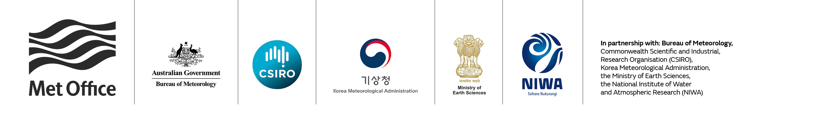

# Cylc Development Workshop 
__Bureau of Meteorology, Melbourne, Australia__ 

3-7 December 2018

## Table of Contents
- [Context](#context)
- [Format](#format)
- [Preparation](#preparation)
- [What to bring](#what-to-bring)
- [Goals](#goals)
- [AGENDA](#agenda)
- [Participants](#participants)
- [Acknowledgements](#acknowledgements)

## Context
Over the next 12 months we need to migrate Cylc to Python 3, and replace the
aging PyGTK GUIs and simple client/server architecture with a more complex
architecture and a web GUI. And the new system has to be performant "out of the
box" for existing critical production use. This is a challenging task!!!

## Format
Mainly discussion sessions, with some demoing and coding (to the extent
possible at this the early stage of development, and with our varying levels of
experience)- not formal presentations (except perhaps Wednesday afternoon).

## Preparation
Read and understand (as far as possible at this stage):
- [Cylc-7 Architecture](cylc-7-architecture.md)
- [GUI Replacement Options](gui-replacement-options.md)
- [Cylc-8 Architecture and Web GUI Roadmap](cylc-8-roadmap.md)
  - those of us who have researched particular aspects in depth should
    be prepared to talk about it
- A few Cylc Issues that are relevant:
  - [One GUI using technology for web applications](https://github.com/cylc/cylc/issues/1873)
  - [New GUI: scalable navigable view using quilts](https://github.com/cylc/cylc/issues/2753)
  - [suite http(s) server improvements](https://github.com/cylc/cylc/issues/2563) 
  - [Future Cylc Authorisation/GUI Architecture](https://github.com/cylc/cylc/issues/2729 )
- [Jupyter Hub Architecture](https://jupyterhub.readthedocs.io/en/stable/) - we
  think we need something very like this (with _notebook_ = _suite daemon_)
- Consider what you might like to work on, and how much effort you can
  contribute in the next year or so.

And for the new people:
- Understand how to define, run, and interact with basic Cylc workflows,
  non-cycling and cycling
- Work through the basic tutorial in the [Cylc User
  Guide](https://cylc.github.io/cylc/documentation.html) and the better
  Cylc tutorial in the newly-rewritten [Rose User
  Guide](https://metomi.github.io/rose/doc/html/index.html) 
 
## What to bring
- Your development laptop, with a Cylc repository clone on board and tested
- Working demos or other material to present, if you have any

## Goals
By the end of the week we need to understand:
- How we will work together to develop the new system
  - in principle we have more effort than ever before and should be able to
    make great progress
- Who will do what?
- Where technological or architectural choices have to be made,
  - which way will we go?
  - or (at the least) how to decide very quickly which way to go?
- How can we test the separate parts of the new system, given their interdependence? 
- When can intermediate milestones be achieved along the way?
- (Is the team big enough now that we can start on some important "future Cylc"
  work concurrently with GUI development? - see [Possible Cylc
  Futures](https://github.com/cylc/cylc/wiki/Possible-Cylc-Futures) and
  [Vision for Cylc beyond 2018/2019
  Priorities](https://github.com/cylc/cylc/wiki/Vision-for-Cylc-beyond-2018-2019-Priorities))

# AGENDA
Items listed below are to guide the discussion, but we can be flexible if
needed. Several of us are relatively expert on selected topics already and
can start by walking the rest of us through it. Tentative decisions have
already been made in a few areas (e.g. to use Vue.js for the GUI). We can
consider coding and demo opportunities on any day, if time allows..

### Monday
- __Morning__
  - (Combined session with the BoM/Altair Control Panel Stream)
  - Introductions, with interpretive dance
  - Overview and showcase of work and plans on the BoM/Altair/Cylc project
    (Control Panel, Apache Kafka, reporting DB, authentication etc.)
  - Then: begin afternoon topics early, if possible

- __Afternoon__:
  - (Cylc Development and working practices)
  - (as we have a bunch of new team members!)
  - git, GitHub, GitHub Flow, testing, Travis CI, Codacy, Riot.im or Slack?, etc.
  - The development roadmap: what's been discussed and decided so far?
  - Then: begin Tuesday's Architecture discussion early, if possible

### Tuesday
- __All day__:
  - (Architecture)
  - System components:
    - GUI, "hub", reverse proxy, sub-services for suite discovery and start-up, etc.
    - other? GUI server, "suite state server", ...?
  - How closely can we follow (and even borrow code from) Jupyter Hub?
  - What runs where? Privileged, or as the user?
  - Server-side Python framework(s)
    - Flask (+gevent?) or Tornado?
  - Inter-component communication - network protocols and API(s)
    - WebSocket and GraphQL seem advantageous (compared with HTTPS and a REST
      API) but do they need to go all the way from the GUI to the suite
      daemons? If not, what are the implications?
    - alternatives at the back end? ZeroMQ, Protocol Buffers (& gRPC?)?
  - Suite server data structures
    - are lists of nodes and edges sufficient for all views? 
    - exposed via GraphQL? (by the suite server, or a GUI server?)
  - Which component serves the actual HTML pages (as opposed to just data)?
    - suite daemon, or GUI server?
  - Do we need a simplified architecture for individual use?
    - or just run all components as the user?

### Wednesday
- __Morning__
  - (Combined session with the BoM/Altair Control Panel Stream)
  - software testing, packaging and distribution
  - "scheduler prediction tool"
  - `setup.py` for Cylc
  - (Begin afernoon topics, if possible)

- __Afternoon__
  - (Cylc user feedback and discussion)
  - deficiencies, feature requests, problem solving
  - A presentation or two, if called for
    - e.g. revisit the Brussels Worklfow Workshop Cylc and Rose keynote?

### Thursday
- __Morning__
  - (Authentication and authorization)
  - user authentication: site integration, session management
  - session management for CLI commands?
  - automatic job authentication: one-time tokens?
  - if authentication is done by the Hub, how do suite daemons trust the Hub?
    - SSL client certificate?
    - what if not using HTTPS?
  - authorization - how to do it?
- __Afternoon__
  - Begin the Web GUI discussion if time allows (see Friday morning)

### Friday
- __Morning__
  - (Web GUI)
  - Which Javascript framework: Vue.js (or React.js, or...)?
  - unify gscan and gcylc?
  - UI design ideas
  - How to display very large suites effectively and efficiently
  - Interaction with other components:
    - To suites (via proxy) or to a UI server?
    - Incremental update of suite state data?
    - WebSocket? - no polling by GUI!
    - GraphQL?

- __Afternoon__
  - (Tie it up and nail it down, with reference to the Workshop [Goals](#goals))
  - Retro
  - Review of risks
  - Delivery timeline
  - Who can work on what?

# Participants

- Hilary Oliver - NIWA (Wellington, New Zealand) - <hilary.oliver@niwa.co.nz>
- Bruno Kinoshita - NIWA, (Auckland, New Zealand - <bruno.kinoshita@niwa.co.nz>
- David Sutherland - NIWA, (Wellington, New Zealand) - <david.sutherland@niwa.co.nz>
- Raghavendra (Raghu) S. Mupparthy - NCMRWF (Noida, India) - <raghav@ncmrwf.gov.in> 
- Dave Matthews - ESiWACE, Met Office (Exeter, UK) - <david.matthews@metoffice.gov.uk> 
- Sadie Bartholomew - Met Office (Exeter, UK) - <sadie.bartholomew@metoffice.gov.uk>
- Matt Shin - Met Office (Exeter, UK) - <matthew.shin@metoffice.gov.uk>
- Oliver Sanders - Met Office (Exeter, UK) - <oliver.sanders@metoffice.gov.uk>
- Martin Ryan - BoM (Melbourne, Australia) - <martin.ryan@metoffice.gov.uk>
- Sujata Patnaik - Altair (Bangalore, India) - <sujata.patnaik@altair.com>

# Acknowledgements

Thanks to BoM, Altair, the UM Partnership, and ESiWACE for sponsoring this
workshop, by providing a venue, and/or travel funding, and/or development
resourcing! 

