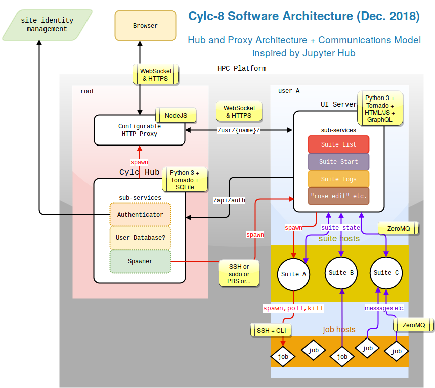

# Cylc-8 Architecture

_Author:_ Hilary Oliver (last updated 17 December 2018)

_Contributors:_ Dave Matthews, Sujata Patnaik, Matt Shin, Oliver Sanders, Sadie
Bartholomew, Martin Ryan, Bruno Kinoshita, David Sutherland

_This document is a primary output of the 3-7 December 2018 Cylc Development
Workshop at the Bureau of Meteorology, Melbourne, Australia_. It describes the
proposed components of Cylc-8, how they will interact, and the technologies
that we intend to implement them in. 

## Table of Contents

- [Motivation](#motivation)
- [Diagram](#diagram)
- [Description](#description)
  - [Hub](#cylc-hub)
    - [Hub Functionality Overview](#hub-functionality-overview)
    - [Hub Technologies and Sub-Services](#hub-technologies-and-subservices)
  - [UI Servers](#cylc-ui-server)
  - [Workflow Services](#cylc-workflow-services)
  - [User-to-UI-Server Communication](#user-to-ui-server-communication)
    - [WebSocket](#web-socket)
    - [GraphQL](#graphql)
    - [Session Management](#session-management)
  - [UI-Server-to-Workflow-Service Communication](#ui-server-to-workflow-servicecommunication)

  - [Job-to-Workflow-Service Communication](#job-to-workflow-service-communication)
  - [Authorization](#authorization)
- [Similarity with JupyterHub](#similarity-with-jupyter-hub)
- [Terminology](#terminology)

## Motivation

Cylc-7 is written in Python 2, with PyGTK native desktop GUIs, and relatively
simple [local client/server architecture](cylc-7-architecture.md) in which
everything runs as the user, all clients are treated equally (user GUI and CLI,
and job CLI), clients get server information via the filesystem and port
scanning, and automatic owner-only authentication via a suite-specific
passphrase file. (Un?)fortunately:

- Python 2 end-of-life is 1 Jan 2020, after which ["there will be no [Python 2]
  updates, not even source-only security
  patches"](https://github.com/python/devguide/pull/344).
- PyGTK is Python 2 based and has not been updated for years.

We have decided __not__ to port the existing Cylc GUIs to PyGObject (the
successor to PyGTK) because _there is strong demand for a new architecture that
supports an in-browser web GUI and integration with site identity management
systems._ This is (necessarily) more complicated but it will enable us to:
1. Provide a single point of access to many Cylc workflows on a pool of servers.
1. Run and interact with workflows via a web browser, without requiring:
    - a Cylc installation on the front-end (browser) platform
    - a shared filesystem or SSH access between the front-end and workflow
      platforms
1. Drop the requirement for port scanning by users.
1. Retire the suite-specific passphrase files and self-signed SSL certificates.
1. Integrate with site identity management.
1. Support fine-grained authorized access to specific worflows.

## Diagram

__Figure 1__ Cylc-8 Architecture: The "user A" box represents processes owned
by a particular user (the _suite owner_) but potentially running on multiple
_workflow hosts_ (on a shared filesystem) and multiple _job hosts_. The term
"HPC Platform" is used rather loosely - potentially only the jobs reside on
actual HPC nodes. The yellow boxes show the technologies that will be used to
implement the component or channel. 

__This architecture is inspired by JupyterHub__ - which solves a very similar
problem of managing back-end services spawned into user accounts (see below:
[Similarity with Jupyter
Hub](#similarity-with-jupyterhub-for-jupyter-notebooks)).
In fact we hope to use JupyterHub (Open Source, [3-Clause BSD
License](https://opensource.org/licenses/BSD-3-Clause)) "out of the box" for
the Hub and Proxy. Our back-end components are very different from a Jupyter
Notebook, but some of the same technologies are appropriate nevertheless:
Python 3, the [Tornado](https://www.tornadoweb.org) asynchronous web framework,
and the [ZeroMQ](http://zermoq.org) asynchronous messaging library.

## Description

### Cylc Hub

#### Hub Functionality Overview
- At start-up, the Hub launches a web proxy.
- The proxy forwards requests to the Hub by default.
- The Hub handles user login (authentication) and spawns UI Servers on demand.
- The Hub configures the proxy to forward URL prefixes to the UI Servers.

#### Hub Technologies and Sub-Services
- A privileged process (`root` or `sudo` - see [running
  JupyterHub without root
  privileges](https://jupyterhub.readthedocs.io/en/stable/reference/config-sudo.html))
  - (It must be able to spawn [Cylc UI Servers](#cylc-ui-servers) as user processes).
- Implemented in Python 3 with the [Tornado](https://www.tornadoweb.org) web
  framework.
  - Tornado is based on an _asynchronous event loop_, the state-of-the-art for
    scalable request handling in Python.
- Spawns a __web proxy__ that it dynamically configures to route requests to
  services. The proxy is:
  - A single point of access for users.
  - The only process that listens on a public interface.
  - Implemented with
    [jupyterhub/configuable-http-proxy](https://github.com/jupyterhub/configurable-http-proxy)
    ([Node.js](https://nodejs.org/); wraps
    [node-http-proxy](https://github.com/nodejitsu/node-http-proxy)).

- Hub Sub-Services:
  - Authenticator - calls out to host or site identity management; plugins for:
    - PAM (sufficient for sites where PAM local accounts are driven by AD or LDAP?)
    - LDAP
    - OAuth (for accounts with GitHub, Google, and others)
    - (extendible: custom authenticators)
  - User Database
    - stores Hub state, such as which users are running which workflows, and
      where (Hub user names only, no sensitive information)
    - sqlite (light-weight, zero-admin)
  - Spawner - spawn [Cylc UI Servers](#cylc-ui-server) on user accounts, by:
    - ssh
    - sudo
    - PBS
    - Docker
    - (extendable: custom spawners)

For more detail on component interaction, including session management, see
[JupyterHub Technical
Overview](https://jupyterhub.readthedocs.io/en/stable/reference/technical-overview.html).

### Cylc UI Server

- (Spawned by the [Cylc Hub](#cylc-hub) on demand.)
- Serves the UI to the user's browser, for uniform presentation of stopped
  suites and static services as well as running suites (a workflow service can
  only be queried if it is running).
- Receives suite state updates from Workflow Services (push - no polling)
- Implement in Python 3 + [Tornado](https://tornadoweb.org) +
  [Vue.js](https://vue.js.org)
  - (Tornado is [described above](#cylc-hub))
  - [Vue.js](https://vue.js.org) is the smallest but fastest-growing of the
    current top-three front-end Javascript frameworks. It is lighter than
    Angular and React, and is reputedly the easiest to learn. In terms of UI
    components our needs are quite modest, so we will try the "simplest" modern
    framework first.
- Must run as the user (that is the suite owner, not the UI user) because it
  must run sub-services as the user.
  - (consider another user authorized to view your suites: she must be able to
    read your suite files without relying on local file permissions - she might
    not even have a local account on the workflow host).
- One UI Server per user (i.e. per suite owner account).
  - Each UI server fronts multiple suites.
  - Efficiency benefits for multiple UIs looking at the same suite?
  - Relieves workflow services of some comms load.
  - BUT consider one UI server per UI (i.e. per browser tab) for simplicity, if
    the aforementioned efficiency benefits can't be realized.
- (Could potentially scrape suite databases rather than query workflow
  services, to remove all comms load from the suites ... but this has the
  potential for latency problems on NFS?)

- UI Server Sub-Services
  - Suite listing service (via the filesystem):
    - Location and identity of running workflow services (host:port).
    - Location and identity of inactive suites (stopped or never started).
    - Status of stopped suites (e.g. "stopped with N failed tasks").
  - Suite start service:
    - Start up new workflow services (from inactive suites).
  - Static services:
    - `cylc graph` (dependency and inheritance graph visualization).
    - `cylc review` (formerly Rose Bush).
    - View suite definition.
    - Suite analytics.
    - `rose edit`.
    - etc.

## Cylc Workflow Services

Largely unchanged from cylc-7 "suite server programs", except:
- Python 3
- ZeroMQ, for communication with the UI Server

## User-to-UI-Server Communication

- (GUI or CLI)
- Via the Proxy.

- Suite status updates.
  - [GraphQL](https://graphql.org/) API over
    [WebSocket](https://en.wikipedia.org/wiki/WebSocket)
  - (rather than REST API over HTTPS).

- Suite commands.
  - Not much data transferred here, but WebSocket would still allow the server
    to return results to clients even when command has to be queued for
    asynchronous execution (in cylc-7 the user gets no direct feedback).

#### WebSocket
- Efficient, persistent full-duplex connections over TCP, initiated by HTTPS
  handshake.
  - (c.f. HTTPS: one-way one-off stateless connections.)
- Allows server-push of status updates when ready.
  - No need for continual polling by the GUI.
- Good when server-side data changes quickly and unpredictably - that's us!

#### GraphQL
- Alternative to a REST API.
- A single flexible endpoint.
  - (c.f. many fixed inflexible REST endpoints.)
- The query determines what data is returned and in what form.
- Should allow the UI to request just what it needs very easily.

#### Session Management
- GUI: the usual browser cookie based mechanism.
- CLI (multiple commands without repeatedly entering credentials manually):
  some kind of in-memory or on-disk equivalent of browser cookies, or some
  kind of single-use token?

## UI-Server-to-Workflow-Service Communication

- (suite status updates; commands)
- Server-server: can use something more efficient than HTTPS or WebSocket.
- [ZeroMQ](http://zeromq.org) messaging library (also used between Jupyter
  Notebook Servers and Kernels).

## Job-to-Workflow-Service Communication

- (Job-executed CLI commands).
- [ZeroMQ](http://zeromq.org) messaging library.
- (Implies CLI clients need to talk both ZeroMQ _and_ WebSocket, because 
  CLI commands executed remotely, or by other users, have to go via the Proxy).
- Trust (server authentication) - single-use token?

## Authorization

- Need two levels:
  - UI Server: who is allowed to connect to my UI Server?
  - Suites: who is allowed to do what to which of my suites?
- Both levels _could_ be enforced by the UI Server, which runs as the user and
  can therefore see the same authorization data that the suite services can.
- simple text files that map users or groups to privileges?
  - (By Unix group, good for service accounts?)

## Similarity with JupyterHub for Jupyter Notebooks

[Jupyter Notebooks](https://jupyter.org/) are a proven technology commonly used
in scientific and educational institutions worldwide for interactive
programming and sharing web documents that contain embedded code.
Architecturally, the user's browser talks to a Python
[Tornado](https://www.tornadoweb.org)-based _Notebook Server_ that communicates
via the [ZeroMQ](http://zeromq.org) network library with a back-end _Notebook
Kernel_ that executes the code. Both the notebook server and kernel run as the user.

[JupyterHub](https://jupyterhub.readthedocs.io) is used to deploy and manage
single-user notebooks for large numbers of users within an institution. It
consists of a privileged _multi-user Hub_ (a Python
[Tornado](https:www.tornadoweb.org) process) that:
- is a single point of access for all users
- handles user authentication, with plugins to integrate with site identity
  management
- spawns single-user Notebook Servers on user accounts
- spawns a configurable Web Proxy to route requests to the single-user
  Notebook Servers
- provides a REST API for "convenient administration of the Hub, its users, and
  services"

[JupyterHub is extremely well documented](https://jupyterhub.readthedocs.io),
including (for example) a [security
overview](https://jupyterhub.readthedocs.io/en/stable/reference/websecurity.html)
of the architecture.

__This architecture is (almost) exactly what we need for Cylc-8__, with:
- _Notebook Server_ => _Cylc UI Server_, and
- _Notebook Kernel_ => _Cylc Workflow Service_

For an in-browser GUI to spawn and access a distributed set of Cylc workflow
services running under various user accounts, we need a central "hub" that can
spawn user processes and proxy requests to them, and a "UI Server" component to
construct the UI (HTML/Javascript) around workflow status data obtained from
the workflow services (and also static data about stopped workflows).

### Differences from Jupyter Notebook

The Jupyter Notebook back-end is highly specific to the Notebook Document
format. For Cylc, we have Workflow Services instead of Kernels, and we need a
Cylc-specific UI Server (with a bunch of Cylc-specific sub-services for suite
discovery and start-up etc.) instead of the Notebook Server. Further, Jupyter
Notebook Servers fronts a single Kernel, whereas a Cylc UI Server may need to
access (and possibly collate) data from multiple workflow services.

However, we do share the two-level "web server / kernel" back-end model, and we
have therefore decided to use ZeroMQ for back-end communications. It is a
well-used, efficient network library, and we may be able to learn by studying
the Jupyter model - including the automatic trust (server authentication)
mechanism.

### Differences from JupyterHub

There is only one difference that we're aware of:
- JupyterHub [does not
  yet](https://github.com/jupyterhub/jupyterhub/issues/394) support access to
  other users' Notebooks, whereas we need (authorized) access to other users'
  workflows services. 

However, multi-user access is presumably as simple as allowing access to
`/user/{other-name}/` URLs (in the Jupyter case the show-stopper is that the
Notebooks themselves, at the back end, don't support shared use yet).

We therefore hope __we can use JupyterHub "out of the box" for the Hub and
Proxy components of the Cylc-8 architecture__. The only question is,
can the (minor?) multi-user access change be done (e.g. by plugin) without
modifying the core of JupyterHub so that we can treat it as a third-party
software requirement, or can we contribute a change back to JupyterHub to
enable that, or do we need to fork the project and maintain our own "Cylc Hub"
in the future?

## Terminology

A Cylc __workflow__ is a single (possibly cycling) __suite__ of inter-dependent
tasks.

A Cylc __workflow service__ is workflow manager program for a single workflow,
formerly known as a __suite server program__ or a __suite daemon__. (Cylc has
no central server - each workflow gets its own ad-hoc service that runs as the
user).

