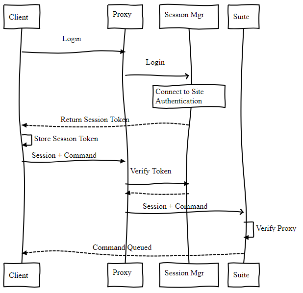

# Cylc Web GUI & Architecture – Tentative Roadmap

(Latest update: 1 Nov 2018)

__Target completion date: late 2019__ (Python 2 end of life)

_WARNING - this document is slightly out of date in places, since recent team
meetings, but not in a way that will hurt you._

## System Components, Communications, etc.

We need something very much like the [Jupyter
Hub](https://jupyterhub.readthedocs.io/en/stable/) Architecture: a privileged
hub that spawns a reverse proxy server and sub-services for suite discovery etc.,
and spawns UI servers (c.f. Jupyter notebooks) and potentially suite daemons as
the user.

__Note__ below the term "reverse proxy server" may encompass full "hub" (and
sub-service) functionality as well as a web proxy (but these should be
separate components).

### Core Principles & Motivation For The New Architecture

1. Enable users to run suites via the browser from any platform without
   requiring a Cylc installation on that platform.
2. Enable users to view and interact with suites on remote platforms without
   requiring shared filesystem or SSH access.
3. Remove the requirement for port scanning.
4. Retire the self-signed SSL certificate.
5. Provide a single point of access to Cylc suites running on a server,
   group of servers or trust zone.
6. Replace the on-disk plain-text passphrase authentication between the client
   and the web UI.

### Reverse Proxy Server

    1. Single point of access, to:
        1. Discover and present suites, and route client requests to them
        1. (this could include for task job clients - status messaging etc.
           especially for jobs running on remote platforms with locked-down
           ports)
    2. Uses several sub-services:
        1. Suite discovery (running and stopped suites) ([not needed?](
      https://github.com/cylc/cylc/issues/1873#issuecomment-416000070))  
        1. Suite start-up (stopped suites)
        1. User authentication (below)
        1. Static services: “cylc graph”, “cylc review” (formerly Rose Bush), …
        1. GUI server for suite status data (see H)?
    3. Extend to access to other services: “rose config-edit”, rosie suite repository
    4. Implementation:
        1. Python web framework: Tornado, Flask?
        1. Ad-hoc server or WSGI service? (under Apache, NGINX, gevent?)

### Suite Status Data

    1. Underlies the following displays:
        1. Detailed suite status views: dependency graph, text tree, “dot”
        1. Multi-suite summary status
        1. Task inheritance tree (to expand/collapse task families in all views)
    2. The new GUI needs to be more integrated and dynamic than the old:
        1. Multi-suite summary (and stopped suites) and suite views, all at once
        1. Show only selected parts of a large suite (esp. for the graph view)
    3. For efficiency, we need to rethink how suites present this data
        1. Avoid sending redundant or unneeded information to the GUI
        1. Clients to select just what they need: suggests GraphQL endpoint?
        1. Incremental updates – can we send only what’s changed?
    1. Lists of nodes and edges (or just edges, with full nodes at each end?)?
        1. (probably can't use a nested tree structure based on runtime
           inheritance - it would be useful for collapsible familiy views,
           but the dependency graph can't be encoded in this form).  
    1. [Oliver's thought's on data structure and GraphQL schema](
    https://github.com/cylc/cylc/issues/2563#issuecomment-411345934).
    1. [Relay: pagination with GraphQL](
    https://www.howtographql.com/react-relay/8-pagination/).

### Suite Server API

    1. server “endpoint” functions presented to clients
    1. Currently a REST API: multiple fixed and inflexible endpoints
    1. We may want a GraphQL server instead: one simple, flexible endpoint?
    1. Do we expose the API to clients, or translate at the Reverse Proxy (or GUI Server?)?
    1. Implementation: [Python web framework](
    https://steelkiwi.com/blog/top-10-python-web-frameworks-to-learn/):
        a. Ad-hoc server or WSGI service? (under Apache or NGINX or gevent?)
        a. [Flask](http://flask.pocoo.org/) (+gevent?)
        a. [Tornado](https://www.tornadoweb.org/en/stable/) (async even at
        Python 2; "ideal for websocket or long polling")
        a. ([popularity](https://python.libhunt.com/compare-tornado-vs-flask?rel=cmp-cmp))
        a. Other? Django; [Sanic](https://github.com/huge-success/sanic)
        (flask-like async); [AIOHTTP](https://aiohttp.readthedocs.io/en/stable/)
    1. Distinguish between the "suite status API" (for the GUI - WebSocket and
       GraphQL an advantage here?) and the "suite control API" (for commands
       like `cylc stop` and `cylc trigger` - WebSocket and GraphQL less of a
       win, but could use for overall consistency, and get real response back
       from commands without polling)

### GUI Server?

    1. (collates status data from multiple suites and serve the GUI)
    1. Do we need this?
    1. Pros:
        1. take (almost) all comms load off the suite server programs by scraping
           the suite databases instead of network API
           1. but what about disk latency? (e.g. if on NFS)
        1. present information about currently-stopped suites in uniform way
    1. Cons:
        1. Complexity? - another component
        1. suite status information is less "distributed" - would a GUI server
           be a memory hog (for a lot of large suites)?
    1. should run as the user (one per user)?
    1. spawned by the "hub"?

### Suite Server Communication Protocol

    1. The WebSocket protocol may be ideal:
        1. Very efficient, persistent full-duplex (and therefore server push)
        1. No need for polling by the GUI?!
        1. Proper quick feedback in response to client commands?
    1. The reverse proxy means suite servers don't necessarily have to talk
       HTTPS (or WebSocket)
    1.  (protocol buffers over HTTPS also suggested, but unlikely)

### Authentication

    1. For the GUI, and for client CLI commands executed by users
    2. Current method (automatic owner passphrase on disk) won’t work for web GUI
    3. How to plug in to site identity management? (LDAP, AD, RedHat IPA)
    4. Session management for GUI (session tokens stored as secure cookies?)
    5. Session management for command line clients??
    6. Authenticate at the Reverse Proxy, not at suites?
        1. Require suites to automatically trust the reverse proxy – SSL Client Certs?

### Authorization

    1. (which users can do what?)
    1. Authenticated user information passed to suites from reverse proxy?
    1. Simplest: text file read by suite and/or reverse proxy, mapping users to privileges
    1. At suite server program: is user authorized for the requested action?
    1. Reverse proxy: can user spin up a suite or service, or connect to an existing one?
    1. (authentication by job clients - see next section)

### Job-to-Suite Communications

    1. (“job authentication” required for status messaging and other client commands)
    1. Currently jobs authenticate automatically as the user - won’t work for web GUI
    1. Secure one-time token provided by the suite program?
    1. Jobs connect directly to suites, OR go via the Reverse Proxy like user clients?
        1. Jobs don’t need “suite discovery” (the suite can tell its jobs its location)
        1. But going via reverse proxy may still be convenient for other reasons

### GUI

    1. Which front-end JavaScript framework? (Angular, React, Vue, D3, …?)
        1. Must look good, and be efficient and responsive for very large suites
        1. May/June demos suggest development won’t be as difficult as the old
           GUIs (but instead we have many architectural issues to contend with).
        1. Should pages be served by the suites, or a “GUI server” under the reverse proxy?
        1. From suite server endpoints, or suite DBs?  Is latency a problem in the DB case?
    1. “Serve Everything” (GUI has no access to the filesystem)
        1. Current GUI gets some information from the filesystem:
            1. Static suite visualization and validation (parses suite config file)
            (low priority?)
            1. Live access to job logs (uses “cylc cat-log” which reads files off disk)
            (low priority?)
            1. Edit run (generate new job file and present it in the user’s editor)
            (higher priority)

### Transition Period

  1. Users must continue to use the old GUI while we developg the new one 
    1. Evolve the old GUI along with the new suite API?
    1. Or support the old API as-is concurrently with the new?
    1. Or develop the cylc-8 separately on a new branch?

  - __DECISION: develop cylc-8 separately on a long-lived dev branch__
    - the new system is too different to develop "in place"
    - early migration to Python 3 also demands this

### Packaging

   - proper `setup.py`-based installation for pip and conda
   - ditch bundled libraries (Jinja2 etc.)
   - allow different installation groups, e.g. "single user" and "full" (the works)
   - Bruno has made a good start on this already

   - __DECISION: definitely needed__

__Figure 1__: Current (cylc-7) architecture: simple: all clients are equal (CLI,
GUI, Jobs), automatic owner authentication; but suite discovery and
authentication require clients to see the file system (also port scanning for
discovery) – an in-browser GUI cannot do this. 

__Figure 2__: Proposed new architecture

__Figure 3__: possible client-suite interaction, in the new architecture

__Figure 4__: possible job-suite interaction, in the new architecture

## Prioritization

Many of the following activities can be done concurrently if we have a big
enough team. But we should prioritize the highest risks where possible.

1. __Identify the front-end framework for the UI__ - not a big risk (many
   frameworks would do) but it is a big unknown, and we may have to spend
   considerable time learning the technologies

   - Angular.js? (been around a while, but relatively heavy-weight)
   - React.js? (by Facebook, most popular)
   - Vue.js? (increasingly popular, lighter than React, more "template"-like)
   - D3.js? (focused on "data driven" display of charts etc.)

   - __DECISION: Vue.js__
        - we'll start with Vue, unless we run into problems that suggest we
          should convert to React
        - we may be able to use some of D3's libraries for graph display etc.

1. __Python 3 Migration__
    
    - Port to Python 3 after everything is developed?
        - can keep the old GUI in the interim
    - Do the Python 3  migration first
        - can develop all the new stuff in Python 3 
    - What new techniques can we exploit after the initial style change?
        - Asyncio for the main loop?

   - __DECISION: Migrate to Python 3 first__
        - otherwise we may be stuck with outdated versions of some critical
          libraries
        - Bruno has had an initial crack at this and got a simple suite to run

 
1. __Test Coverage Reports__
   - and then more tests, for better coverage where possible
   - need this for confidence in the initial Python 3 port 
   - Bruno has implemented this, with GitHub integration

   - __(DECISION: Done: PR in review)__
 

2. __Make long-lived cylc-8 development branch__
   - the new system is way too different to do incrementally and (compatibly)
     on master
   - then:
      - delete the old GUI
      - packaging
      - test coverage
      - Python 3 migration
      - and all the new bits...
  
   - __DECISION: to be done immediately after cylc-7.8.0 release__

1. __Prototype the reverse proxy and the communication flow__ This is the
   foundation of the new architecture, so we should be comfortable with it
   sooner rather than later. We need to understand where the components sit and
   what technology to use.  Risks and unknowns:
   1. How to do initial authentication, and then management of authenticated sessions?
   1. (How) Does it work with our enterprise identity management systems?
   1. How to spin up new services/suites as user?
   1. How to route requests and session tokens to existing services/suites?
   1. How to exploit WebSocket for our use?
   1. How can existing services/suites trust the reverse proxy?
   1. Who/what serves open static content?
   1. Do we write the new code in Python 3, given its independence from other
      components? (Some important modules may no longer be maintained in Python 2.)

3. __Finalize API and authorization management__ for suite and other services.
   There are many things to do here, but they should be relatively
   straightforward.
    1. Determine who should serve what and how. E.g.:
        1. Uni-directional or bi-directional via WebSocket.
        1. GraphQL to replace the REST end points currently used to serve the UI views.
        1. GraphQL to replace the rest of the REST end points?
    1. Migrate "cylc review" (formerly Rose Bush) to new service points.
    1. Develop other essential service points and logics.
    1. Authorization and session management.
    1. Job to suite session management.
    1. Continue to develop the UI as we evolve the API to suit its needs.

