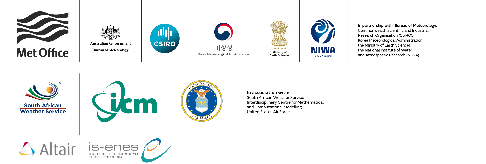

## Cylc Development Workshop 2020
### 10-14 Feb, NIWA, Wellington, New Zealand

## Goals

Primarily: to review Cylc 8 progress and chart the roadmap to completion. Cylc
8 has a more complex architecture than Cylc 7 (and earlier versions) and it makes
use of a much wider variety of technologies and protocols. This is an
opportunity for us all to get a better understanding of the complete system as
well as plan next steps.

For each of the main topics below we will cover:
  - What we are aiming for
  - What we have achieved so far - with demos
  - What is still to be done
    - and any major problems still to be solved

## Preparation

Participants should bring a notebook computer with root access to a recent
Linux system, and preferably have Cylc 8 installed and running already from git
clones of each component.

Those who have worked on aspects of the project already should be prepared to
explain and demo their parts of the system to others. And we should all be
prepared to ask questions until we understand the whole system.

## Agenda

Acronyms used below:
- WFS = Workflow Service (formerly known as the "suite daemon" or "suite server program")
- UIS = UI Server
- (UI, CLI = ...duh)

### Monday 10 Feb: Architecture and Data Provision

- Welcome and Introductions etc.
- Components and code repositories
- Getting everything installed and running - demo
- Issues that still need some thought:
  - Remote spawning
  - Scaling and load balancing
  - CLI via the UI Server (e.g for task communication)
  - Access to other-user workflows
  - Hub Sub-services: Workflow start-up, Cylc review, tasks beyond the active window, other?
- Data provision to the UI:
   - Data stores and incremental update via ZMQ, Protobuf, GraphQL
- Practical debugging session:
  - UI (browser and Vue tools), WFS (incl. subprocesses), UIS (incl. async
    routines), traffic between components

### Tuesday 11 Feb: UI

- Web UI overview:
  - Vue.js, common data store, subscriptions, GraphQL, websocket, etc.
  - Mutations (commands) and API-on-the-fly
  - Performance considerations
  - Task/job separation and implications
  - Spawn-on-Demand: comparison with Spawn-on-Submit, implications
- Treeview status and plans
- Other views TBD: dot, graph, etc.
- Whiteboard/inkscape session on remaining design issues:
    - Gantt view
    - Multi-workflows/dashboards
    - selecting sharing (drag n drop?)
    - how to represent xtriggers
    - theming?
    - other?
- CLI: entry points, new `cylc monitor`, CLI simplification? (post API-on-the-fly)

### Wednesday 12 Feb: Configuring and Running Workflows

- Config file names and locations: WFS (workflow, user, site), UIS, Hub
- Proposed config item changes, and the new cylc-flow platforms config
- Should plugins be allowed to add global config items?  ([cylc][plugin:kafka]server=ab.c.d:123?)
- Rose suite-run migration, new "cylc run" semantics, and rationalizing the workflow start-up CLI
  - `name/run1,2,3...` etc.
- Contingency for delayed Rose 2: Python 2 release with `rose suite-run` etc. stripped out?

AFTERNOON:
- visit NIWA operations?
- visit NIWA HPC facility?

EVENING:
- workshop dinner?

### Thursday 13 Feb:  Authentication, Authorization, Security

- Hub: authentication plugins; sessions; managing identity; which config options?
- Back-end connection authentication:
  - Hub-UIS, UIS-WFS, CLI-WFS, CLI-UIS
  - WFS and ZMQ auth files
- Single user issues, e.g. standalone (sans Hub) UIS? (like Jupyter notebook)
- BOM security concerns:
  - review cylc-7 pen testing report
  - review threat modeling notes
- Authorization
  - All handled by the UIS (not WFS)?
  - Can we settle on authorization levels and corresponding privileges?
  - Configuration and implementation

### Friday 14 Feb: Deployment and Documentation

- Versioning (and milestone) strategy (now we have many repos)
- Future of the `cylc` central wrapper and multi-version support?
- Minimal client install?
- `cylc --version` and the cylc meta-package - part of cylc-flow or not?
    - need to solve https://github.com/cylc/cylc-admin/issues/76
- Use of conda pack?
- Reducing the size of conda environments?
- "Portable conda environments" for no-internet deployment
- Optional dependencies?
- Installing without conda?
- Reducing size of the UI `dist/` package
- Containers: how many Docker files; use of Docker compose; non-Docker?

- Component version compatibility
  - how should new versions deal with existing (running) WFS at older versions?

- Documenting Cylc 8 for admins and users

- **Update the Projectt Gantt Chartt** to Cylc-8.0.0 by (or before) mid-2021

## Participants

- Hilary Oliver - [NIWA](https://www.niwa.co.nz), (Wellington, New Zealand) - <hilary.oliver@niwa.co.nz>
- Bruno Kinoshita - [NIWA](https://www.niwa.co.nz), (Auckland, New Zealand - <bruno.kinoshita@niwa.co.nz>
- David Sutherland - [NIWA](https://www.niwa.co.nz), (Wellington, New Zealand) - <david.sutherland@niwa.co.nz>
- Dave Matthews - [IS-ENES3](https://is.enes.org/), [Met Office](https://www.metoffice.gov.uk), (Exeter, UK) - <david.matthews@metoffice.gov.uk> 
- Tim Pillinger - [Met Office](https://www.metoffice.gov.uk), (Exeter, UK) - <tim.pillinger@metoffice.gov.uk>
- Mel Hall - [Met Office](https://www.metoffice.gov.uk), (Exeter, UK) - <mel.hall@metoffice.gov.uk>
- Oliver Sanders - [Met Office](https://www.metoffice.gov.uk), (Exeter, UK) - <oliver.sanders@metoffice.gov.uk>
- Jacinta Richardson - [BoM](https://www.bom.gov.au), (Melbourne, Australia) - <jacinta.richardson@bom.gov.au>
- Tim Whitcomb - [NRL](https://www.nrlmry.navy.mil/), (Monterey, USA) - <tim.whitcomb@nrlmry.navy.mil>

## Acknowledgements

Thanks to NIWA for hosting the workshop, and the UM Partnership and IS-ENES3
for sponsoring travel for relevant participants.

