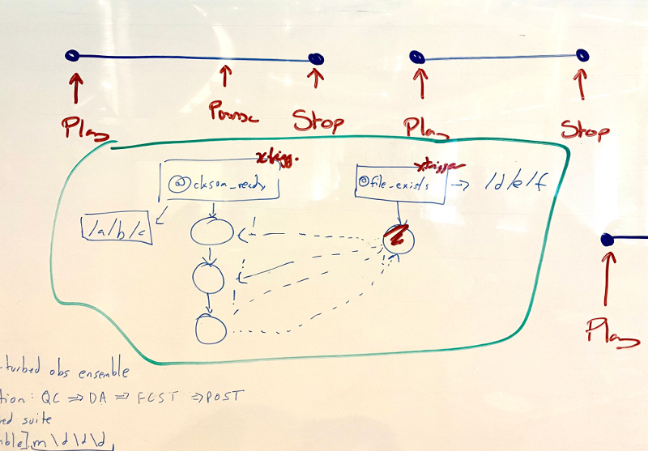
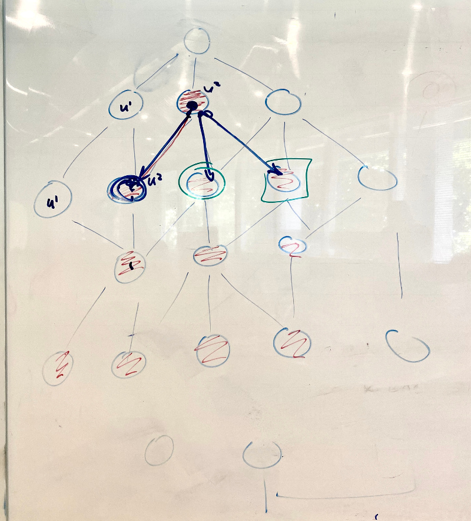
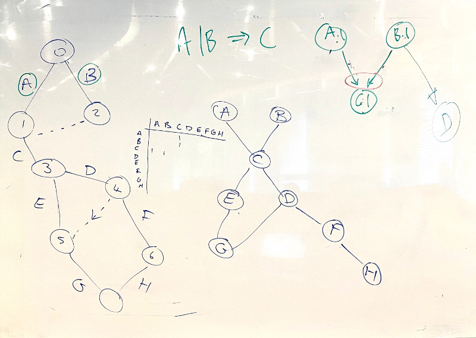
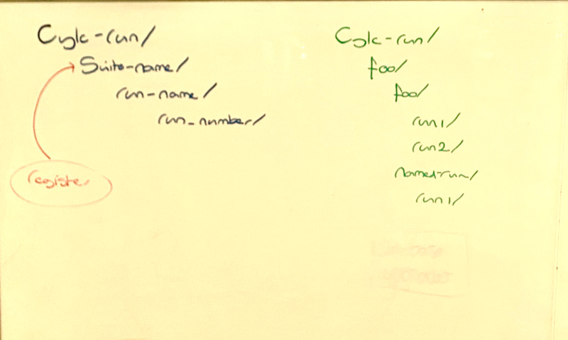
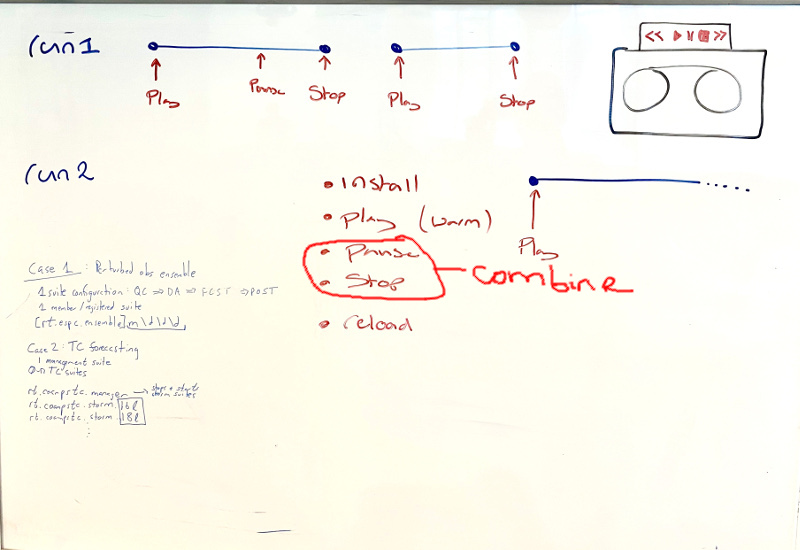
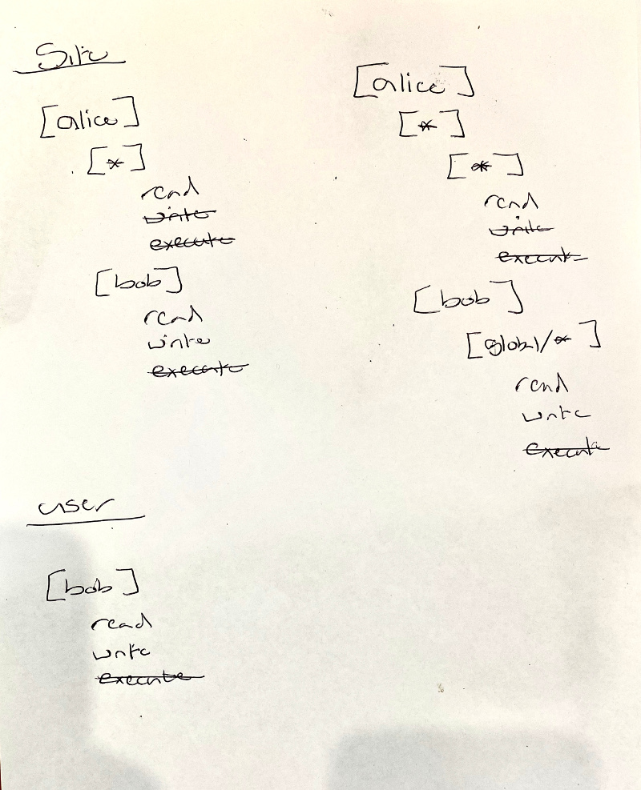
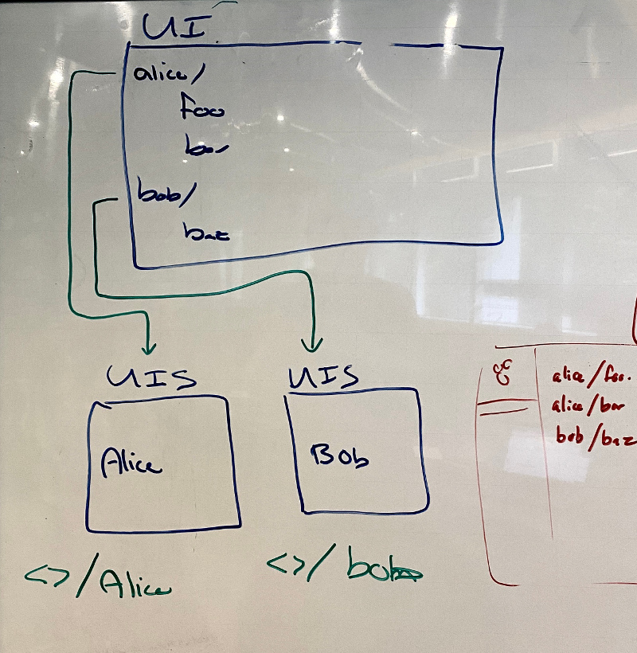
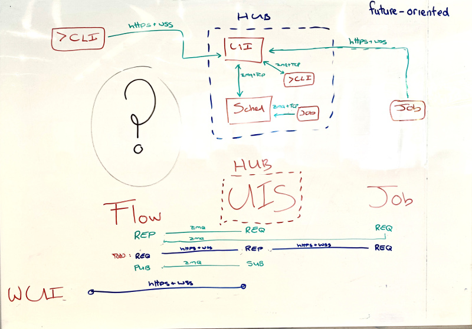

## Feb 2020 Cylc Workshop Notes

(Points noted mostly in the order they arose in discussions; to be organised later)

## Monday 

- (DM) cross-user functionality is essential for 8.0

- (DM) apparently not all J-Hub internal communication is secure yet. Need to
  investigate and check latest release

- OS: selection sharing between views needed in 8.0 if possible (e.g. select 
  tasks in treeview, see same tasks in graph view)

- UI Design TODO: how to display the status of mutations that are in progress?
  Need to be able to minimize and expand.

- TW: table is still needed for an "information-dense" view, column-sortable 
  - filter by job exit code (see next point)

- TW: discussion on capture and use of job exit codes
  - non-zero values are supposed to indicate failure but some applications do 
   use them to convey other info
  - triggering off of exit codes would be easier than translating to custom
    messages in the job script: `foo:127 => bar`
  - not ideal in multi-command user-written job scripts (did the exit code come
    from the expected command? - makes more sense for single "job commands"
    but we could support this and warn users of potential pitfalls.)
  - we could allow "job fail but task succeed" so the workflow can carry on
    (the automatic analogue of manual reset to succeeded)
  - (message triggers will be displayed in the UI - design TODO)

- Cylc Review: currently deleted from cylc-flow, but needed for 8.0.
  Contingency, easiest-but-least desirable first:
  - restore as-is with Python 2.7, and as a separate service   
  - port to Python 3, still a separate service 
  - full integration with UI views (post 8.0)

- Hub remote spawning of UI Servers
  - (JR) BOM may have a problem with this (in production area)
    - can we manually start UI Servers, and have them connect to the hub (this
    would require authenticating with the hub as the user and somehow
    transferring the right auth info to the UIS to make them connect - difficult?)
    - (HO) was told J-Hub approved by the architecture team; single-point of
    access and site ident integration was insisted on by BOM and requires this
    kind of architecture (with distributed run-as-the-user components on the back end)
    - (DM) let's not go down this route until we know if it really is a problem
    - JR to find out more and report back
  - (OS) load balancing of multiple UIS (many users) on multiple VMs: should be
    able to take the existing psutils infrastructure from cylc-flow (for load
    balancing schedulers) and integrate it into our spawners
  - a UIS should time out and die if no one is looking at it (and spawned
    again when needed) even if not using much resource at idle - opportunity
    for upgrading the release

- CLI via UIS (or rather, via hub proxy)
  - needed for CLI to other-user workflows, or from account with access to the
    workflows filesystem access
  - also possible solution to remote job sites with only HTTPS ports open? (TW)
    - but need to figure out how authentication would work?
  - configurable choice or fall-back? (CLI direct to Sched, then via UIS) 
  - OS: we could abstract out the protocol bit from CLI ("just a send/receive
    interface, with authentication) to allow swap out ZMQ for
    something else (but note plain https can't do subscriptions); (ZMQ is TCP
    with Curve auth).
  - HO: CLI to hub solves the UIS persistence problem as hub will spawn one
  - `cylc scan` is an edge case, only needs UIS to see other users

- (BK) note that our wss header for authentication is not set yet, anyone can
  connect if they can see the endpoint

- new `cylc monitor` demo:
  - closely replicates the web UI treeview
  - needs state totals at top and responsive filtering (this should make it as
    useful as the old monitor for displaying failures quickly, while remaining
    vastly more useful in other ways).
  - will add mutations
  - (can keep old monitor as well if really necessary - it's pretty trivial)

Data Provision
- [DS Slides](https://cylc.github.io/cylc-presentations/CylcCon2020-data/index.html)

- Event driven, incremental update, throughout the system, is almost done.
  - (the two new PRs are implemented via a different subscription to avoid
    breaking the current UI, until we mod the data store to the new way ... has
    to test with Graphiql for now)

- DS had to integrate GraphQL with ZMQ ourselves (no lib solution yet)

- n=N window: Sched keeps active tasks (n=1 window), but UIS could cache
  historical data back to n=3 say, to avoid going to disk for that

- GraphQL allows fine-grained authorization (on individual fields) identical
  for CLI and wUI

- UIS detects running schedulers with imported `cylc scan` code (which scans
  the filesystem)

- what data is kept in each data store?
  - longer term the scheduler data store should become *the* scheduler state,
    so we should keep the full n=1 window, for all available data, there
  - currently the UIS mirrors the full scheculer data store, but each
    subscription topic is incrementally updated as content changes
  - OS: the plan was to have the UIS data store only populated according to
    the UI subscriptions.  We can still look at this as next steps, but:
    - data stores seem to be much smaller than expected (1MB for complex
      suites?) so it might not be an issue to keep all the data there
    - however, the new UI gscan sidebar shows the problem in principle: at
      UI start-up gscan's subscription will cause the UIS to immediately load
      all the data for all the workflows it can see - seems unnecessary
    - but (DS) subset at the UIS would require parsing the incoming
      subscription to figure out what new subscription, if any, needs to be
      subscribed to at the schedulers ... which seems difficult. Nested queries
      are particularly difficult to analyse in this way, but (OS) we are going
      fully flat anyhow. Nested queries are particularly difficult to analyse
      in this way, but (OS) we intend to go fully flat anyhow
   - what about data outside of the active window? UIS can ask the sched first;
     if nothing returned go to disk instead?
   - OS: showing the future graph will be more difficult in the future; may
     be able to go back to n=N, but forward only to n=1.  At the moment we
     can go forward using the graph config, if all possible future paths are
     graphed, but future dynamic sub-graphs cannot be known in advance (display
     as an empty box that gets populated once known?)

## Tuesday

- DM: Suite UUID? (messages from orphaned tasks rejected as UUID differs from
  that in the contact file). Suite "run number" is probably simpler than UUID.

- Agreed how to represent retries & other xtriggers in the UI - OS to update
  the Issue pages. Most xtriggers like nodes in the graph view, but queued
  should be shown as a badge like held (and only if the task is actively held
  back in the queue; queued takes precedence).

-  selection sharing, i.e. link views in the UI. Could link focus of two views,
   e.g. by mouse drag, then subsequently keep linked, or not?  If linked,
   should be two-way.

- job icon theming is in already - have standard, greyscale, colour blind, but
  no way to set prefs yet. Theming should be straightforward, just needs to be done.

- User Preferences:
  - TODO: can the Hub DB or our own Hub Service + DB store user preferences?  
  - authentiated users don't necessarily have an account on the back end, so we
    should store prefs at the Hub (slightly more general than browser cookies).
  - Prefs export/input functionality for easy switch to other hubs?
  - named profiles might be needed, to associate different prefs with different
    UI Servers (e.g. ops vs test) - after 8.0
    - or just do this via user@hub box color?

- Graph View
  - Cytoscape not good for our needs (canvas vs svg, display engine)
  - Dagre layout engine is needed
  - but writing our own display engine should be hard (OS had a POC ready in one day)

- BK debugging demo:
  - front end: browser dev tools, including Vue extension
  - back end: PyCharm, easy to connect to subprocesses

- DS on the data stores: concerned about how to group changes once the Sched main loop is gone.
  The main loop is a convenient way to ensure that changes to various data
  elements are grouped in a self-consistent whole before pushing to the subscription.

- OS: need CylcCon page on the website to show that we are an active project. HO to do.

Spawn-on-Demand (HO)
- Tantalisingly close to do-able within the current "task pool" framework, for Cylc 8?
- Needs n-edge window for the UI to be effective
  - but we need to deal with this anyway
  - SoS has some serious problems, we've just learned to live with them
- `cylc monitor` needs to go via UIS and direct to WFS (Workflow Scheduler).
  Direct will see on n=0 (active tasks)
- Need an "n-max" setting that will populate entire cycle points in the UI
- Can treat succeded and failed states equally (in SoD, remove them
  immediately) - but we can choose (optionally?) to keep them until dismissed,
  at least until the UI has better ways to alert users to failed tasks
  - a list of failed tasks? Have to be able to retrigger from the alerting list
- Tracking conditional prerequisites is tricky, requires in-memory or perhaps disk caching?
  - (JR) if needed, use existing disk caching or in-memory DB (redis) systems for this
- Can't let suite stalls result in shutdown because no active tasks left in the pool!
  - watch out for failed tasks that are not a graph leaf node
  - so: don't remove tasks whose outputs were not handled - i.e. they did not spawn
      (conditionals are difficult again?)
- Need a battery of examples to clearly demonstrate expected behaviours (HO to start this)
- (TW): consider two tasks waiting on different xtriggers; if one gets
  satisfied it means the other never will and needs to be removed from the
  suite. It seems we'll still need suicide triggers to achieve that removal?
  (HO to consider and update SoD proposal).
 

- (OS) "task pool" no longer a good term? (HO not so sure... now it's just a pool of active tasks.
- (OS) TaskProxy should be renamed Job? (the Proxy class has been gutted, no
  longer doing retry logic etc.)
- Can we unifiy outputs and prerequisites/triggers?
- Reflow could be super-useful (just trigger the top task of the tree to re-run)
  - HO: need a "flow ID" passed along via the on-demand spawning mechanism
  - hard to support partial triggering by tasks from the original flow (have to
    search arbitrarily far back to determine whether a task can be fully
    satisfied within the reflow or not?)
  - initially may have to disallow reflow (retriggering just runs the one task)
    or require manual triggering of tasks with off-flow prerequisites
   
- (MH) interesting idea on representing tasks as edges that connect task event nodes.
    - looks somewhat promising but difficult to see how to handle multiple
      outputs and conditional triggers. Investigate further for Cylc 9?
 

Asyncio and coroutines (OS)
- we should make an event-driven system where coroutines process queued task events
    - e.g. job submission done by a coroutine that processes job submission events
    - queues become the state of the workflow (which need to be cleared for shutdown)
- better xtriggers:
  - "push" xtriggers, e.g. for suite-state (await socket, yield result)

## Wednesday 

(Config item discussion extended to Thursday morning - all noted here though)

New Platforms Config:

- proposal generally agreed
  - (JR) should help with BOM two-cluster setup

- `[foo/d/d|bar/d/d]` - need to support comma-sep list for consistency (but
  can't prevent OR'd regex obviously)

File Installation (`rose suite-run` migration):
- this is next up for implementation
  - what gets installed needs to be configurable, or else copy all

- need a shell interface as well as `psutils` for "load" on platforms, e.g. to
  query number of pending PBS jobs

- TW generally agrees with the `rose suite-run` way of working with suites, no
  need to continue supporting the old way

- Ideally file installation and FS setup needs to be handled as a "pre-graph"
  task, for visibility (otherwise pre-detach ties up the terminal, and
  post-detach is hard to show users what's happening).

- New "run1, run2" structure:
  - new run for any "cold start", for safety and provenance
  - "in-place warm start" use case requires option to copy or mv data dirs from
    prev run
  - might want to compress logs in old runs
  - NN symlink to latest run
  - NEW: first under cylc-run dir should be the suite source name (with
    location link inside it) - the source is a template for multiple suites,
    which can each have multiple runs
    - this is just to impose a clearer convention - it uses the existing cylc
      reg hierarchy capability. Otherwise nothing has changed.

- run (and install) command semantics
  - need a separate command for install, avoid confusing compound commands 
    - (however, a "cold start" should always install)
  - NEW (actually, discussed in Exeter, but we forgot!) use git to automatically 
   manage the installed dir - detect and describe changes, checkout to install, etc.
  - `--set` Jinja2 command line parameters should be stored in the install dir
    in a user-readable config file (they are in the DB for restart use, but not
    really visible to users)

NEW run command names (intuitive, good UI icons):
  - `cylc install`
  - `cylc play` (cold start, warm start, restart-from-state-snapshot, un-hold)
  - `cylc stop` (shutdown, pause)
- deprecate old commands via invisible alias? (for scripted use of them)
- Rose: drop `rose suite-run` and print a helpful error message if users invoke it.

Config File Changes

- File Names agreed:
  - `flow.cylc`
  - `global.cylc`

- (DM) let's not bother deprecating global config changes

- need ability to configure site global conf location by `CYLC_CONF_PATH` for
  cylc installations with no `/etc` access.  Default to `/etc` though.

- agreed on the conf dir hierachy in the proposal (need version sub-dirs)

- agreed on the "alternative" scheduler platform config proposal

- `task event batch interval` (for event mail batching)

- get rid of `cylc` section entirely

- `platforms`, NOT `job platforms`

- move all `cylc point` items to the scheduling section
  - future: need clearer names of initial vs start, and stop vs final cycle
    points?  (start and stop may be "inside" the graph)
  - UTC mode: separate config needed for cycle point UTC mode from log
    timestamps

- need `stop after cycle point` (have `hold after...`)

- `expected task failures` - leave as-is (ref tests only)

- `abort if any task fails` - deprecate this config and make it a command line
  option

- `scheduler environment` - remove it!
  - (otherwise for consistent behaviour on local and remote hosts we have to
    export these vars in subprocess before command invocations, ... but this
    will get muddied once we allow async *functions* as well as subprocess
    (e.g. event handlers)

- TW: we need to restore non-local dummy mode to allow investigation
  of the effect of resource changes on a workflow (you can tell PBS it has more
  resources than it really has, then request more but just submit a dummy task...)
  - we have removed this already from Cylc 8 because dummy-local is much
    simpler to implement as just a "dummy platform".

- `simulation: disable suite event handlers`
  - should be phrased positively
  - `[scheduling]use suite event handlers = True`?
  - (hmm, can't recall what we decided on this)

- `[editors]` - discourage use and make it default to `$EDITOR` and `$GEDITOR`
  (and to `vi` if those vars aren't set).

- agreed to use None as config default instead of emtpy string, to allow us to
  distinguish "set to nothing" from "not set"

- `disable interactive command prompts` - remove command prompts

- change `batch system` to `job runner`
  - "batch system" is a poor name for background jobs
  - and for future cloud-y and otherwise non-HPC ways of running jobs

- batch system handlers should be plugins (we put an issue up for this)

- `batch system command template` - put an issue up to consider removing this
  (inconsistent as no poll and kill templates here) but leave for now as it is
  used in the test battery about 6 times.

- `task event handler retry delays` is not needed as a platform setting (remove
  it)

- remove `scp command` config, and the `scp-copy` util command

- test battery config section can be removed as now in `global-tests.cylc`
  (but need to check this)

- `extra log files` - remove this and just provide access to all files found
  in the job log dir (DS to remove from data schemas too)

-  (forget other suggested item name changes, not worth it)

- TODO:
  - get current config-affecting PRs merged, then
  - update the config proposal via PR, then
  - OS to document configs with his auto-doc changes

Back-end Authentication (MH)

- CurveZMQ
- currently the private key gets copied to job hosts
  - we should generate key pairs at both ends and transfer the public ones both ways
    - test for shared FS
- uses existing ZMQ API to generate the keys
- client times out if access denied (unfortunately that good from a security perspective)
    - we could report "connection timed out, this could be due to ..."
- WFS -> ssh -> job leaves a small window for "man in the middle" attacks
    - solved pretty well by not authorizing jobs to send anything but 
      `cylc message` back ("platform authorization")
- "ssh messaging" needs to be restored on master
   - do it via ssh tunnel with ZMQ
- (TW): need CLI-UIS for remote platforms
   - can we use a Hub API to generate tokens and use those to authenticate?
- (JR): all messsages might need timestamps
  - (I think we decided agains this? ... because CurveZMQ protects against replay attacks?)

Authorization
- need site and user config
  - user can ramp up authorization levels as far as the site allows
- groups:
  - (1) locally (site and user) defined lists
  - (2) access to Unix OS groups
  - (3) LDAP groups? (Does the Hub authentication plugin return this info? Probably not?)
      - or query getent()?
      - (JR) OS groups would do, as we link OS and LDAP groups
  - do (1) and (2) initially, (3) etc. after 8.0

- auth config file needs to be `.cylc` format

- 

- (MH) Back-end Authentication 
- Authorization method and config
- BOM C7 pen test report relevance to C8?
- consider and doucment BOM threat modeling points

## Thursday TBD

(carried forward from Wednesday)
- (JR) BOM would like to be able to start the UI in read-only or
  read-execute-only mode, and have a button to escalate to authorized level,
  possibly with force re-authentication at that point. Full privileges should
  time out after a configurable interval of inactivity (probably a full shift,
  because the UI is often used for no-interaction monitoring for long periods).
  (Belongs in Thursday's security session). (Probably after Cylc 8)

Multi-user gscan

What's this? A better network diagram?

To be placed:

