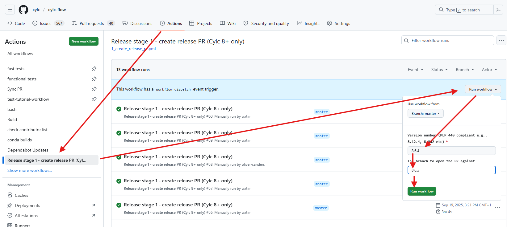

# Releases, Versions and Branches

## Versions & Branches

### Semantic Versioning

Cylc projects use semantic versioning, e.g: for the version 8.1.2:

* 8 = **major** release (implies breaking changes)
* 1 = **minor** release (no breaking changes permitted unless forewarning provided)
* 2 = **bugfix** release (bugfixes and UI/UX issues only, no features or refactors)

Cylc projects are all pinned to the minor version of cylc-flow, e.g:

* cylc-uiserver 1.6.x goes with cylc-flow 8.4.x
* cylc-uiserver 1.7.x goes with cylc-flow 8.5.x
* cylc-rose 1.5.x goes with cylc-flow 8.4.x
* etc

This tight coupling prevents unintended combinations of Cylc components being
installed into the same environment whilst allowing them to be installed in
a modular fashion.

### Bugfixes

When we make a minor release, we create a branch with a `.x` suffix for
subsequent bugfixes.

E.g. `8.1.x` was for bugfixes to `8.1.0`.

Raise any bugfixes against the relevant `.x` branch, a "sync" PR will be
automatically created after it is merged to pull these bugfixes onto the feature
branch.

### Meta-Releases

The collection of components which are coupled to any given minor version of
Cylc are collectively referred to as a "meta-release".

For example, the
[8.5](https://cylc.github.io/cylc-doc/stable/html/reference/changes.html#cylc-8-5)
"meta-release" contains the following components:

* cylc-flow **8.5**.x
* cylc-uiserver 1.7.x
* rose 2.5.x
* cylc-rose 1.6.x

Whereas the
[8.6](https://cylc.github.io/cylc-doc/stable/html/reference/changes.html#cylc-8-6)
"meta-release" contains:

* cylc-flow **8.6**.0
* cylc-uiserver 1.**8**.x
* rose 2.**6**.x
* cylc-rose 1.**7**.x

(note the *minor* version numbers of components have been bumped by one between
these meta-releases)

The meta-releases which are currently supported (i.e, which we continue to
produce bugfix releases for); or under development (i.e, which we continue to
develop features for) are documented on the
[status page](https://cylc.github.io/cylc-admin/status/status.html#branches).

### Project Dependencies

There are dependencies between our projects, here's a summary:

<pre class="mermaid">
---
config:
    look: handDrawn
---
flowchart LR
    isodatetime --> rose
    isodatetime --> cylc-flow
    rose --> cylc-rose
    cylc-flow --> cylc-rose
    cylc-flow --> cylc-uiserver
    cylc-ui -->|bundled| cylc-uiserver
</pre>

### Continuous Integration (CI)

Our CI often needs to install dependent projects in order to run tests. For
example, cylc-uiserver requires cylc-flow to be installed.

These prerequisites will be installed from the development branches, rather
than using released versions.

This is done by the
[`install-cylc-components`](https://github.com/cylc/release-actions/tree/v1/install-cylc-components)
action which uses the
[meta-release data](https://cylc.github.io/cylc-admin/status/branches.json)
(as displayed on the
[status page](https://cylc.github.io/cylc-admin/status/status.json))
to pick the development branch (e.g, `master`, `1.0.x`, `1.1.x`, etc) to
checkout.

## Releases

Before making a release, review the components/versions you plan to release
on the
[status page](https://cylc.github.io/cylc-admin/status/status.html#branches).

### Major / Minor Releases

For major (e.g, Cylc 8.0.0, 9.0.0, etc) and minor releases (e.g, Cylc 8.1.0,
8.2.0, etc), please
[create a "release issue"](https://github.com/cylc/cylc-admin/issues/new?template=new-release.md)
in cylc-admin.

Fill in the information requested and follow the instructions in the issue.

### Bugfix Releases

For bugfix releases, no release issue is required.

### Making A Release

https://cylc.github.io/cylc-admin/status/status.html#branches

Create a new release by running the "Release stage 1" action. Provide this
action with the version number of the release you would like to make, along
with the release branch to use:

The action will run and create a release pull request:

* The version number should be set correctly.
* The changelog should be generated from any Towncrier fragments.

Follow the instructions on the PR, and request a review. The release will be
made automatically when this pull request is merged.

### Conda Forge Releases

Each package we release on Conda Forge has a corresponding "feedstock"
repository in `https://github.com/conda-forge/<package>-feedstock`, e.g
[cylc-flow-feedstock](https://github.com/conda-forge/cylc-flow-feedstock).

Follow these instructions for creating/reviewing Conda Forge releases:

https://github.com/cylc/cylc-admin/blob/master/.github/ISSUE_TEMPLATE/new-release.md?plain=1#L131-L176

See also:
* [conda-build docs](https://docs.conda.io/projects/conda-build/en/latest/resources/define-metadata.html)
* [conda-forge docs](https://conda-forge.org/docs/maintainer/updating_pkgs/)

### Documentation Releases

* **cylc-doc:** [Release instructions](https://github.com/cylc/cylc-doc#deploying).
* **cylc-sphinx-extensions:** Docs updated automatically when a new release is made.
* **metomi-rose:** Manual process - poke Oliver.
