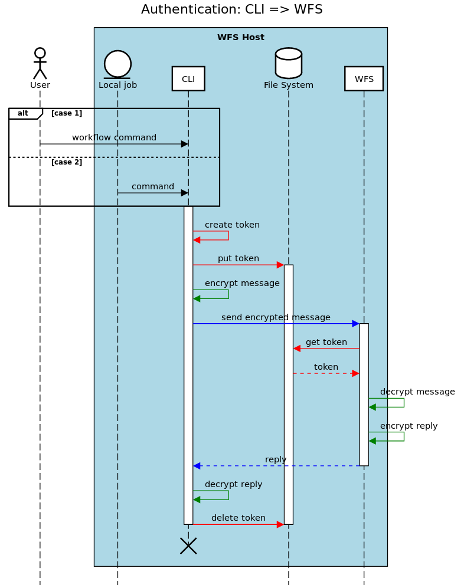
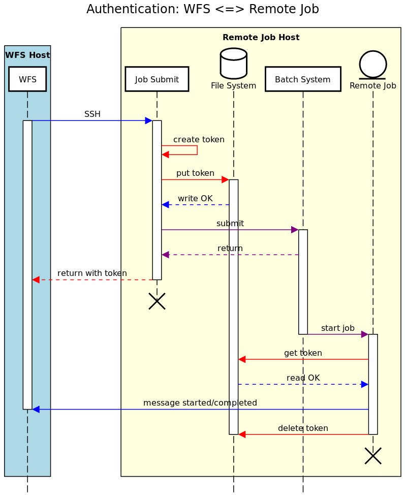

# Proposal for Authentication between the CLI & the Workflow Service

##### Acronyms used:

* CLI == command line interface;
* WFS == workflow service (in Cylc <=7 terminology, the suite daemon or
  server program);
* SSP == suite server program;
* UIS == UI (user interface) server.

## The Problem

### Introduction

We need authentication between the CLI & the WFS in Cylc 8.

#### Client cases

There are various client cases to cover, ultimately, some of which we will treat
in the same way, & some differently (see the next section for requirements):

1. **User (interactive) CLI** => WFS, for user commands:
    1. what I will call **"the direct, or full-privilege full-access (FPFA),
       case"**:
        * user is logged in (authenticated);
        * user is the workflow owner;
        * user has full access to the file system where the WFS is running;
        * the WFS is running as this user.
    2. the user CLI where any of the conditions in (1i) are not satisfied, as
       I will call **the "non-direct or non-FPFA case"**.
2. **Task-job CLI** <=> WFS, for job status messaging etc.:
    1. remote task-jobs that are **on a non-shared file system**;
    2. **any task-jobs not covered by (2i)**, i.e. local ones, or ones running
       remotely on a host where the file system is shared.
3. **Involving the UIS**:
    1. **UIS <=> WFS**:
        * This should be in scope, since this case should be completely
          equivalent to the 'CLI <=> WFS' case, i.e. to the cases in (1) (see
          Q2 under 'Open Questions')?
    2. **CLI => UIS**:
        * This is out-of-scope.

#### Token-based approaches

Discussions on the topic have converged (see e.g.
[here](cylc-8-architecture#command-line-interface) &
[here](cylc-8-tasks#general-authentication-issues-sujata-hilary--damian-and-martin-)
towards using some form of *non-permanent (transient) token* to achieve this.
These forms have been distinguished as options:

* **"timed" tokens**: tokens that *expire*, & *are replaced* with a different
  token, after a set *time period* is up;
* **event-based/driven "one-time" tokens**: "single-use" tokens that are
  *created* & *deleted* to cover the duration of set *events*, only being
  vaild for one such event instance.

### The old (Cylc 7) approach

The approach for authentication between the CLI & the suite server program
(name for the Cylc 7 WFS equivalent) is
[described here](cylc-7-architecture#authentication). It is ultimately
a token written out on-disk in plain text, that relies on Linux file
permissions to be secure & only usable by the suite owner.

Note the phrase "passphrase" is used historically, but it is not actually
a user-specified mnemonic passphrase (though users can override it with one,
but we believe this is done rarely), it is a *random token* that is generated
on the first run of a suite. Since the token ("passphrase") is valid for
the lifetime of that suite, it is *effectively a one-time suite-level token*,
where the creation event is the first suite run & the deletion event is the
deletion of the suite (or its ``.service`` directory).

###  Relevant differences from Cylc 7 to 8

There are aspects of the Cylc 7 authentication we have decided, at the
least, to change, or which otherwise necessitate changes, as follows:

* We now have a UIS, for which we also need to manage authentication (to &
  from it & the WFS, & to it from the CLI).
* In the new architecture, the WFS is a central server, whereas the old SSP
  was a distributed per-suite server, which means multi-user
  authentication is necessary.
* We have decided the new approach should:
  * not require port-scanning;
  * not require SSH access;
  * in some cases at least (notably for some remote task-job clients where
    the file system is not shared so it is not possible) not use the
    file system;
  * not preclude (later implementation of) fine-grained authorisation for
    control capacbility, which is not possible with the Cylc 7
    authentication model.

### Aims: what do we want?

We want to provide & solution that will, by means of, & on top of, being
functional:

* **address the complications** outlined in the previous section;
* **offer increased security**, rather than just being a "rebrand" accounting
  for the above;
* **not preclude, or make difficult, any future work** that we need to or want
  to do, e.g:
  * later work on authorisation, which may rely on a mapping against tokens;
  * work on out-of-scope WFS authentication i.e. (cases 3ii & possibly 3i);
  * perhaps providing the means to restrict what remote jobs are able to do
    on certain platforms, to account for the fact that certain ones have
    different security levels.
* **not be incompatible with any future infrastructure changes** that we can
  foresee, e.g:
  *  jobs running on cloud platforms.

### Open questions

#### On client cases (c.f. 'Client cases' section above)

1. What **cases** shall we manage through the **same approach**?
2. What is **in scope** for authentication **involving the UIS**
   (see cases under 3)?

#### On token choice (c.f. 'Token-based approaches' section above)

3. What **token-based approach** should be used in each client case group as
   in Q1?

#### On token management

4. For timed tokens: how do we deal with the **changeover** of tokens? E.g:
    * will both tokens be valid over the changeover period?
5. For one-time tokens: what **events** do we set as those for which one-time
   tokens are created & then deleted?
     * We should consider the *granularity*, e.g. to make sure there will
       not be a performance overhead from too much interaction with the
       filesystem etc., but not so coarse-grained as to compromise security.
       How long-lived should the events be, along the scale of covering the
       duration of a whole:
         * workflow (as in Cylc 7)?
         * cycle-point?
         * task (i.e. for all of its task-jobs)?
         * job;
         * set of defined (workflow-based) commands?
         * (single) command?

#### On the nature & location of the tokens

6. What **algorithms &/or standards** to use (see also Q9)? Notably for:
    * tokenisation (signing, verification, etc.);
    * encryption, if used;
7. How shall we provide any **related information required to identify jobs**:
    * incorporate it into the token?
    * just have it alongside the token (exposing it, but does that matter)?
8. Which **location** shall we use **to store** the token(s)?
    * Somewhere under each workflow's ``.service`` as before?

#### On implementation

9. What **module(s)** to use (see also Q6). Should it/they be:
    * Python *built-in*? Notably e.g:
        * [``hashlib``](https://docs.python.org/3/library/hashlib.html): "a
          common interface to many different secure hash and message digest
          algorithms";
        * [``secrets``](https://docs.python.org/3/library/secrets.html): "used
          for generating cryptographically strong random numbers".
    * *Third-party*? Notably e.g:
        * [``python-jose``](https://github.com/mpdavis/python-jose): "A JOSE
          [JavaScript Object Signing and Encryption technologies: JSON Web
          Signature (JWS), JSON Web Encryption (JWE), JSON Web Key (JWK), and
          JSON Web Algorithms (JWA)] implementation in Python"
        * [``pyjwt``](https://github.com/jpadilla/pyjwt): "JSON Web Token
          implementation in Python";
        * [``PyOTP``](https://github.com/pyauth/pyotp): "a Python library for
          generating and verifying one-time passwords".

## Working Proposal for a Solution

This is the **current status of the plan** to address defined aspects (else
stated as 'out of scope' meaning to be addressed in the future, after the
rest) for the problem outlined in 'The Problem' section above.

#### Timeline of major updates to the working proposal

* 25.07.19: initial PR up, with a very basic proposal.
* 28.07.19: proposal extended in response to PR feedback from MS, HO & BK.
* 29.07.19: extended again to include UML Sequence diagrams created by MS.
* 01.08.19: proposal updated in response to feedback from DM, & reformatted
  to accommodate much higher level of detail than was originally intended.
* 12.08.19: proposal updated to account for discussions in 'Cylc Core' team
  video conference on 08.08.19 (UK date).
* 19.08.19: amendments made in response to some general feedback by DM & to
  adapt the proposal to the new context & plan relating to overarching
  WFS security, i.e. also considering the network commuications.

### Case-by-case outline

**For command-to-workflow-service (CLI-to-WFS) authentication, use:**

(The numbers below refer to the cases outlined in the
['Client cases' section above](#client-cases), so please cross-reference with
that.)

* (1i) Ideally, & therefore to try in the first instance, **event-based
  one-time tokens, which each last for the duration of a single command (upon
  its execution to its return) only (call them "one-command" tokens)**.
  However, concerns have been raised that such one-command tokens will have a
  significant overhead, so if once they are set up & tested we find that they
  slow the user CLI response times to an extent that is not sustainable, we
  will consider a "plan B" of one of either of the following:
    * setting up sharing of tokens between multiple commands for when commands
      are sent in at a frequency that is considered "high";
    * using direct timed tokens, instead.
* (1ii) Out of scope (in the future this may be supported to go through the
  UIS).
* (2i) **Event-based one-time tokens, which each last for the duration of
  single job only (call them "one-job" tokens)**. They would expire when the
  job finishes (note this means they would apply to multiple commands). These
  would require one of the following:
    * another file per job, which is not ideal as it adds to the file count;
    * a shared combined file containing tokens for all jobs per workflow;
    * extending an existing job file such as the 'job.status' so that such
      files also carry the token information for each job, & preventing that
      information from being displayed in Cylc Review.
* (2ii) **Treat the same as *either* (1i) or (2i) (to which of the two
  remains an open question), so see those cases as above**, where treating
  equivalently to (1i) is possible from utilising the shared file system.
* (3i) Equivalent to cases under (1i), hence **treat like for (1i) as above**.
* (3ii) Out of scope (see note for 1ii).

### Questions addressed & remaining

Overall, from the above case outline, for the questions in
['Open Questions'](open-questions), we have:

* Q1. Two distinct approach used to cover all cases: those described for (1i) &
  for (2i).
* Q2. (3i) is in scope, (3ii) is out of scope.
* Q3. (1i) uses a so-called "one-command" token, (2i) a so-called "one-job"
  token (see the descriptions against these cases); both of these are
  event-based one-time tokens, but the events to which tokens are associated
  to instances are different in each case.
* Q4. n/a, as there are no timed tokens.
* Q5. The lifetime of individual commands for (1i) & same-approach cases, &
      of individual jobs for (2i) & same-approach cases.
* Q6. Not yet decided.
* Q7. Not yet decided.
* Q8. Not yet decided.
* Q9. Not yet decided.

Plus a new question of:

10. Do we authenticate case (2ii) by the same approach as (1i), or the same
    approach as (2i)? Some brief points on this:
      * Treating as for (2i) would be beneficial, as it would mean *all jobs
        are treated equally*. This could have benefits, for instance making
        the storage & reading/writing of tokens for jobs simpler & consistent.
      * But, treating as for (1i) would mean that all cases where the
        file system is shared are treated in the same way, which could have
        its own advantages.
      * It could simply be that the most performant approach of the two would
        be the best choice?

### Case-by-case UML Sequence Diagrams

<!---
These diagrams are generated using the tool at https://sequencediagram.org/

The code to generate these directly from the tool are included in comments
below, so anyone that would like to make edits can do so easily.
-->

#### Key for interaction arrow colours:

* Black: *initiating* interaction
* Red: *token-related* interaction or process
* Green: *en- or de-cryption* process
* Blue: generic message or communication
* Purple: *batch scheduling* interaction or process

### "One-command" (one-time for a single command) tokens, the "plan A" for cases (1i), (2ii) & (3i)

This diagram outlines the interactions for the *creation & deletion*, &
for the *usage*, of valid one-command tokens:

<!---
title Authentication: CLI => WFS:

actor User
participantgroup #lightblue **WFS Host**
entity Local job
participant CLI
alt case 1
User->CLI: workflow command
else case 2
Local job->CLI: command
end
database File System
participant WFS
activate CLI
CLI-#red>CLI: create token
CLI-#red>File System: put token
activate File System
CLI-#green>CLI: encrypt message
CLI-#blue>WFS: send encrypted message
activate WFS
WFS-#red>File System: get token
File System--#red>WFS: token
WFS-#green>WFS: decrypt message
WFS-#green>WFS: encrypt reply
WFS--#blue>CLI: reply
deactivate WFS
CLI-#green>CLI: decrypt reply
CLI-#red>File System: delete token
deactivate File System
deactivate CLI
destroyafter CLI
end
-->

### "One-job" (one-time over the lifetime of a single job) tokens for case (2i)

This diagram outlines the interactions for the *creation & deletion*, &
for the *usage*, of valid one-job tokens:

<!---
title Authentication: WFS <=> Remote Job

participantgroup #lightblue **WFS Host**
participant WFS
end
participantgroup #lightyellow **Remote Job Host**
participant Job Submit
database File System
participant Batch System
entity Remote Job
end
WFS-#blue>Job Submit: SSH
activate WFS
activate Job Submit
Job Submit-#red>Job Submit: create token
Job Submit-#red>File System: put token
activate File System
File System--#blue>Job Submit: write OK
Job Submit-#purple>Batch System: submit
activate Batch System
Batch System--#purple>Job Submit: return
Job Submit--#red>WFS: return with token
deactivate Job Submit
destroyafter Job Submit
Batch System-#purple>Remote Job: start job
deactivate Batch System
activate Remote Job
Remote Job-#red>File System: get token
File System--#blue>Remote Job: read OK
Remote Job-#blue>WFS: message started/completed
deactivate WFS
Remote Job-#red>File System: delete token
deactivate File System
deactivate Remote Job
destroyafter Remote Job
-->

