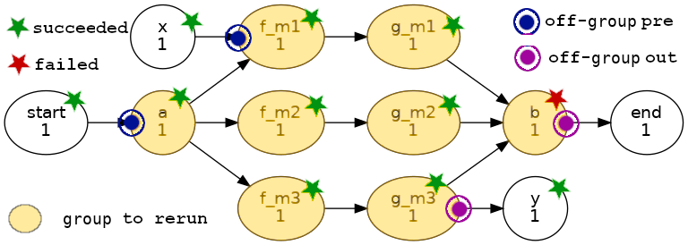

# PROPOSAL: Task Group Triggering

## Background: re-running a sub-graph in Cylc 7 vs Cylc 8

If all affected tasks and their parents are still in the Cylc 7 task pool it may be
easier to rerun a past sub-graph in Cylc 7 than in current Cylc 8, because
it requires some understanding of the graph to identify initial tasks to trigger and
off-flow prerequisites to set in Cylc 8, versus selecting and resetting affected
tasks in the Cylc 7 GUI.

## Proposal

Currently, `cylc trigger TASKS` makes all of the target tasks trigger immediately,
which is likely not the desired behaviour if there is any dependence between them
(so, currently, we just avoid doing that).

I propose that we change the default manual triggering to:
 1. respect any internal dependencies between the target tasks, and
 2. automatically satisfy any off-group (i.e., off-flow) prerequisites

If there are no dependencies between the target tasks, this replicates current
behaviour because (2) automatically satisfies all the prerequisites.

If there are any internal dependencies, this makes rerunning any sub-graph in
Cylc 8 (where the tasks can be identified as a group) very easy.

## Implementation

The group of tasks to trigger can be identified by family name, glob, or list.

Examine all prerequisites, and set (satisfy) any that point outside of the group, to:
- immediately trigger the initial tasks of the group, and
- satisfy any off-flow prerequisites that would otherwise cause a stall

### Details

   1. match n=0 and future tasks to command args, and record all the task IDs
   1. (if not triggering with `--flow=new` then erase the previous flow from
      each task in the group - depends on remove extension implementation)
   1. examine the prerequisites of each task in the group
       - for n=0 tasks, just query their prerequisites
       - for future tasks, use taskdef methods to compute their prerequisites
   1. satisfy any off-flow prerequisites
       - this spawns the owner tasks into n=0, avoiding a future stall
   1. spawn any parentless tasks in the group (i.e. `cylc set --pre=all`)

Note this also solves the problem of how to "trigger a whole cycle" easily, because
it will automatically identify the initial tasks of the cycle, and set any off-flow
(inter-cycle) prerequisites.

### UI

This should become the default behaviour of the trigger command.

### QUESTIONS

#### Un-satisfy existing in-group preprerequisites in existing n=0 tasks?

Probably not. Users might want to pre-set some prerequisites before triggering
the group.

#### Prevent flow-on downstream of the group?

I don't think we should do this. Rerunning a group of tasks should behave just
like rerunning a single task in this respect.

### Example

Task `b` fails and as a result we need to rerun all the yellow tasks.
Off-flow prerequisites and outputs are marked with target icons.

-----

## Appendix: Comparison of Cylc 7 and 8 (current) sub-graph rerun

### Cylc 7 sub-graph rerun

#### C7_a group members and their upstream parents remain in the task pool

1. reset all group members to waiting (e.g. by family name)

#### C7_b (if any group members or parents have left the pool)

1. insert all group members as waiting
2. insert all off-flow parents as waiting
3. reset all the parents to succeeded

Dependency matching will then cause the sub-graph to run correctly.

### Cylc 8 sub-graph rerun

#### C8_a general, new flow

1. trigger the initial task(s) of the sub-graph (with `--flow=new`)
2. satisfy any off-flow prerequisites (with `--flow=n`)

In this case, you might need to deal with flow-on downstream of the sub-graph if it
doesn't dead-end or merge with an existing (typically failed incomplete) task.

#### C8_b general, re-flow

1. `cylc remove` all group members to erase the previous flow
2. trigger the initial task(s) of the sub-graph
3. set any off-flow prerequisites

In this case, flow-on downstream of the sub-graph is not a problem. Any
downstream tasks that already ran won't rerun in the same flow, and otherwise
the flow should continue as normal if the sub-graph re-run was successful.

### Comments

C7_a is the simplest. It relies on the group and its parents still being in the task
pool, but that is often the case when dealing with same-cycle problems. If so,
users can get away without understanding the task pool.

C7_b is the least intuitive of all - it requires understanding the task pool,
task insertion, and the graph (e.g. to identify off-flow parent tasks).

C8_a is conceptually clean, and general, but it does require an understanding of the
graph structure to identify initial tasks and off-flow prerequisites, and it might
result in unwanted downstream activity.

C8_b is like C8_a, but trades off unwanted downstream activity for `cylc remove`.
