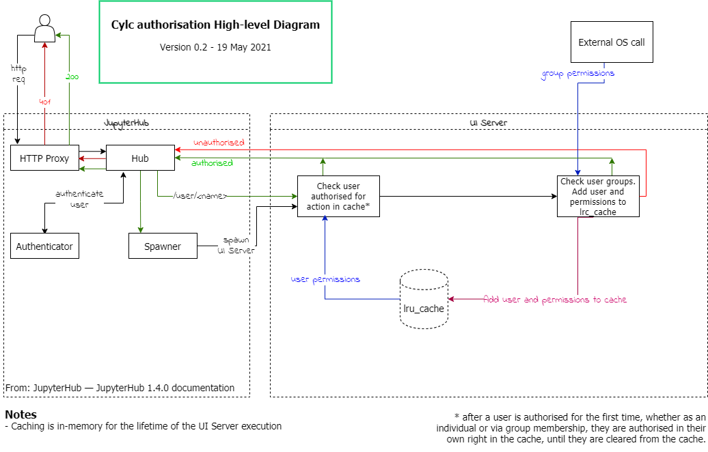

# Multi-User Functionality & Cylc Flow Proposal

## Background

Pre Cylc8 there was some level of multi-user functionality offered by Cylc.

We had the "anonymous" user, the ability to scan other users suites and HTTP(s)
endpoints had authorisation levels.

With the movement to the Cylc8 architecture we are planning to control suites
via a UI Server running as the suite owner for UI purposes meaning that, from
the Cylc Flow perspective we only need to authenticate the suite owner. All
multi-user capability and authorisation happen at the UI Server.

## Introduction

Cylc Flow should be a single-user application with no ability to see or
interact with other users' workflows at all.

All multi-user functionality should be provided by the UI Server and, where
applicable, made accessible to the ``cylc`` CLI tools via the GraphQL
interface.

Work discussed here will be implementing accessing of other users' UI Servers, the orange arrow in the diagram below.


## Security Considerations

In line with the guidance provided by [section 4.1 of the OWASP ASVS](https://github.com/OWASP/ASVS/blob/master/4.0/en/0x12-V4-Access-Control.md#v41-general-access-control-design) (Application Security Verification Standard):

* Authorisation will be *fail secure* and *deny by default*. That is, unless explicit authorisation has been granted to the user to perform a given action, UI Servers will be locked down.
* The *principle of least privilege* should be adhered to, whereby users are only granted those privileges that are essential to the work they are doing. To achieve this, UI Server owners will need a sufficient level of granularity for configuring access.

UI Server back-end code should prevent users manipulating client-side code to bypass authorisation. For example, sending a GraphQL query for a different operation to that stated in the operation name parameter.

## Configuration

Two configuration files will be needed, one for site and one for users. This authorisation configuration can be added to the existing UI Server config files, although this may prove a technical challenge. Authorisation configurations should be loaded at start up and stored as a dictionary. This means any changes to config will require the UI Server to be restarted before they are applied.

### Config Design

The config discussed at [CylcCon2020](https://github.com/cylc/cylc-uiserver/issues/10#issuecomment-773752542) suggests admin levels of `read`, `write` and `execute`. Reducing the number of access groups is another suggestion, especially since write and execute are not very meaningful to users (in terms of Cylc) and to ensure users do not accidentally give away more privileges than intended, a simpler system, as outlined below, may be preferential. Proposal: `READ` and `CONTROL` permission groups.

### READ and CONTROL

For the purposes of clarity for users, and since we have operation (mutation) level granularity, the simpler method of having two groups, `READ` and `CONTROL`, rather than three. A further group, `ALL`, can be used to provide full access (`READ` + `CONTROL` + high risk operations). Access groups should be entered in caps to avoid confusing e.g. `READ` with read mutation.

### Example UI Server User Configuration

```python
c.UIServer.authorisation = {
    "<user1>": ["READ", "pause", "trigger", "message"],     # Specified interactions granted to user1
    "group:<group1>": ["ALL"],                              # Access to all operations workflows
                                                            # granted to users in group1
    "<user2>": ["READ", "CONTROL", "!trigger", "!edit"],    # All READ and CONTROL, except trigger and edit
                                                            # granted to user2
    "<user3>": ["READ"]                                     # READ only access
    "<user4>": ["!ALL"]                                     # user4 has no access to workflows
}
```

### Example Site Configuration

```python
c.UIServer.site_authorisation = {
    "<*>": {                    # For all ui-server owners,
        "<*>": {                # Any authenticated user
            "default": "READ",  # Will have default read-only access
        },
        "<user1>": {              # user1
            "default": [
                "!ALL"            # No privileges for all ui-servers
            ],                    # owners.
        },                        # No limit set, so all ui-server owners
    },                            # limit is also "!ALL" for user1

    "<server_owner_1>": {                 # For specific UI Server owner,
        "<*>": {                          # Any authenticated user
            "default": "READ",            # Will have default read-only access
            "limit": ["READ", "CONTROL"]  # server_owner_1 is able to give away
        },                                # READ and CONTROL privileges.
    },
    "<server_owner_2>": {       # For specific UI Server owner,
        "<user2>": {            # Specific user2
           "limit": "ALL"       # Can only be granted a maximum of ALL by
        },                      # server_owner2, default access for user2 falls back to
                                # standard READ only (if server_owner_2/user2 are
                                # included in other auth config e.g. the top example),
                                # or none if not in any other auth config sections.

        "group:<groupA>": {                     # group denoted with a `group:`
            "default": ["READ", "CONTROL"]      # groupA has default READ, CONTROL access to server_owner_2's
        },                                      # workflows
    },
    "group:<grp_of_svr_owners>":{          # Group of users who own UI Servers
        "group: groupB": {
            "default": "READ",             # can grant groupB users up to READ and CONTROL
            "limit": [                     # privileges, without stop and kill
                "READ", "CONTROL", "!stop",  # operations
                "!kill"
            ]
        },
    }
}
```

Whilst most sites and user configs will likely be simpler than this, the above config shows the flexibility available to users with the proposed system.

### Site vs. User Config Precedence, Defaults and Limits

At CylcCon2020 is was agreed that a:

> user can ramp up authorization levels as far as the site allows

Site config `limit` will determine if a user has the privileges to give away access to their workflows. It will also set a `default` access level. Users cannot raise access levels in their UI Server config for a given user or group, higher than those set in site config `limit`.

If the site config does not set access for a given user or group but a UI Server owner grants access, access will be blocked.

Unset defaults for both the `limit` and `default` will need consideration, I suggest that, in keeping with the deny by default principle:

* if a limit is not set but a default is, then the default level is used as the limit.
* if a default is not set but a limit is, then the default should be no access.

If a user does not appear in a ui-server owners config, then the default access from site config will apply. Otherwise, defaults will not impact upon access.

We will need to consider the desired behaviour if a user appears twice with different defaults and limits set, this is probably most likely to occur when a user appears in either multiple groups or in a group and as a user.

Proposal: all permissions are additive, if user appears elsewhere in config, the permission level should be taken as the greatest possible. Note, default in site config does not contribute to permissions, unless user does not appear in ui server owner's config.

Note that `limit` implements site policy.

## Negating permissions

`!` before an operation or permission group will remove those permissions. Negated permissions will take precedence, applied last in the logic to ensure they trump any other assigned permissions.

`!CONTROL` will only remove `CONTROL` operations. To remove `READ` operations, `!READ` will need to be added to the configuration. `!ALL` will also be available to remove all operations, including high risk operations. This will need to be documented.

### Examples of additive nature of permissions with negations

For illustrative purposes (configurations here are perhaps unlikely), the following examples demonstrate negations and the cumulative nature of the proposed config.

E.g.  Suppose User1 is a member of Group1

```python
c.UIServer.authorisation = {
    "User1": "play","pause","!ping"       
    "group:Group1": ["READ"]

}
```

User1 has operations `READ`, `play`,`pause` added but `ping` removed from the list of allowed operations.

E.g.  Suppose User2 is a member of Group2:

```python
c.UIServer.authorisation = {
    "User2": ["!CONTROL"],                              # CONTROL rights removed from User2
    "group:Group2": ["READ","CONTROL"],                 # Both READ and CONTROL access to workflows
                                                      # granted to users in group2
}
```

User2 has operations `READ` and `CONTROL` added through membership of Group2 and then `CONTROL` operations are removed by specific User2 config, resulting in User2 having only `READ` access. This is due to negations taking preference.

E.g.  Suppose User3 is a member of Group3:

```python
c.UIServer.authorisation = {
    "User3": ["READ","!CONTROL", "poll"],               # Specified interactions granted to user3
    "group:Group3": ["READ","CONTROL"],                 # Both READ and CONTROL access to workflows
                                                        # granted to users in group1
}
```

User3 has operations `READ`,`CONTROL` added through membership of Group3 and then `CONTROL` operations are removed by specific User3 config, resulting in User3 having only `READ` access. The addition of `poll` will have no effect. This is due to negations taking preference, and will need to be documented.

## Possible Access Assignment of Mutations and Queries

### Queries

Proposal: All queries can be executed if the user has `Read` access.

### Mutations

If running with the read/admin configuration, initial assignments will be needed, for the case when users set e.g. `READ`, `CONTROL`

Some of the below are not currently available to users but including them here for consideration. This is also a fairly substantial list, which makes the case for read and admin pre-set access groups which would be easier for users and sites to configure, rather than defining a long list of mutations per user/group.

As a springboard for discussion, defaults could be assigned as follows:

### Current Mutations

| Operation | READ | CONTROL | ALL |
| :---     |:---: |:---: |---: |
Broadcast| | |x|
Ext-trigger| |x|x|
Hold| |x|x|
Kill| |x|x|
Message| |x|x|
Pause| |x|x|
Ping|x| |x|
Play| |x|x|
Poll| |x|x|
Read|x| |x|
Release| |x|x|
ReleaseHoldPoint| |x|x|
Reload| |x|x|
Remove| |x|x|
Resume| |x|x|
SetGraphWindowExtent| |x|x|
SetHoldPoint| |x|x|
SetOutputs| |x|x|
SetVerbosity| |x|x|
Stop| |x|x|
Trigger| |x|x|

### Future Mutations

| Operation | READ | CONTROL | ALL |
| :---     |:---: |:---: |---: |
Cat-log|x| |x|
Check-versions|x| |x|
Clean| |x|x|
Compare| |x|x|
Config|x| |x|
Diff| |x|x|
Dump| |x|x|
Edit| | |x|
Get-cylc-version|x| |x|
Get-workflow-version|x| |x|
Graph|x| |x|
Install| |x|x|
List|x| |x|
Reinstall| |x|x|
Report-timings|x| |x|
Scan|x| |x|
Search|x| |x|
Show|x| |x|
Terminal Access| | |x|
Workflow-state|x| |x|
Validate|x| |x|
View|x| |x|

In code, `READ`, `CONTROL` and `ALL` will expand to the assigned operations.

Note `broadcast`, `edit` and `terminal access` are high risk operations and are not assigned to `READ` or `CONTROL`.

Any mutation without a specified access assignment will be denied by default.
As future features are added, they will also need to be categorised.

The associated arguments for the mutations may need consideration.

### Security Check for Permission Level on Config Files

We should set a recommended write permissions level for the user config file. It could pose a security risk to have users config files writable by others. We have a warning in the log if the file permissions are not strict enough, and fall back to locked down permissions (owner only).

## Specific Use Case for Authorisation

Having a site config that can give users who are members of a group with the same name as the UI server owner admin permissions, would be desirable. We could have a namespace `UISOWNER` to achieve this as follows:

```python
c.UIServer.site_authorisation = {
    {
        "<user1>": {                       # User UI Server
            "group:UISOWNER": {            # Members in group of same name as UIS owner i.e. user1
                "default": "ALL"           # Default ALL permissions
            }
        },

```

## Open Config Questions

* Config design model: CylcCon read/write/execute vs READ/CONTROL.
Decision: READ/CONTROL, high risk operations added to ALL

* Access group defaults (suggested in table above) need confirmation/agreement of mapping operations/mutations to correct groups. This is something, that although technically can be changed with ease, would potentially be very confusing for users if changed at a later date.

## Ongoing Investigation: Fetching User Groups

I've tried a number of methods for fetching group membership for the authenticated browser users i.e. return the same groups as I see using `groups` on the Linux command line, which should be both local groups and remote via SSSD/LDAP.

One method reliably returns the expected under PAM:

```python
group_ids = os.getgrouplist(username, 0)
group_ids.remove(0)
users_groups = list(map(lambda x: grp.getgrgid(x).gr_name, group_ids))
```

The outstanding issues with this, that I'd like to resolve is the required second `gid` parameter:

> An integer value representing a group id.
> If gid does not belong to the specified user, it will also be included in the return list

I've used 0 for `root` in the proof of concept work but ideally we would use something like `sys.maxint`.

Testing this works on users' systems might present some challenges - this would preferably be heavily beta tested. If we have concerns, a cruder alternative might be to `Popen` out to the command line `groups`.

If an organisation has a level of nesting in their groups, investigation is still needed - does the command pull the nested groups too? If not, we need to document this limitation for users.

The implementation of groups could be computationally expensive, so these should be cached after first call.



## Ongoing Investigation: Reading Config Behaviour

If a user changes their config, for example, to reduce permissions, we would expect them to restart their UI Server for those changes to take effect. Restarts are currently required for UI updates.

Having a regular interval reload of the config may be an option, depending on other/future configuration requirements. However this interval time could pose a security risk and effects on performance would need to be considered.

## Work Breakdown

The beginnings of the authorisation work have been started [Proof of Concept PR](https://github.com/cylc/cylc-uiserver/pull/204), this is not production ready but a fair chunk of the work has been completed.
This uses hard coded config, the basic functionality of read/write/execute permissions is in place.
Also included in that PR is the beginnings of the user config work.

Still to be completed, once authorisation fine detail has been agreed upon...

* Clear logging of user interaction - important to log which user has executed which operations.
* Config fine tuning.
* Auth group inheritance.
* UI error handling for 403 - e.g. handle read only users getting 403 on admin attempt.
* Ramp up / ramp down logic for site vs. user config.
* UI to display greyed out (unavailable) buttons for mutations without authorisation.
* UI to display currently authenticated user and editable buttons for navigation to another UI Server.
* Documentation for Authorisation
* Set up GH Actions to incorporate multi-user access testing using docker (still at the investigation stage).

## Not supported in this proposal

* Other possible configured attributes such as time-based authorisation. e.g. limit access to UI Server to User_A for 30 minutes.

Whilst this would be useful to help users debug their workflows, screen sharing through Teams, for example, can currently provide access to a users UI Server and workflows. The control can be handed over to another user but the owner/user can remove access control at any time.

* Workflow level granularity

Initially this authorisation work will be implemented on an all workflow basis, i.e. grant User_A access to all my workflows. This was discussed in detail but rejected because:

* giving away CONTROL access to one workflow, could potentially compromise all workflows.
* implementation of filtering gscan would pose a challenge.

* Access level change requiring re-authentication

A change in access level interactions with a workflow could require the user to have to re-authenticate. For example, User A accessing User B's workflows, on an attempted execute operation for a workflow would require User A to login again to re-authenticate themselves. This would need further investigation as may be difficult to implement due to the current reliance on Jupyterhub authentication.
Perhaps a confirmation box may be worth implementing, e.g. You have selected to Pause Workflow_A of User1. Click OK to proceed.

### Command Line

Not directly related to this proposal, although perhaps worth bearing in mind is access on the command line.
e.g.

```console
$ # stop myflow locally
$ cylc stop myflow
$ # stop alice's flow via the UIS
$ cylc stop ~alice/theirflow
$ # stop all flows via the UIS
$ cylc stop '*'
```
