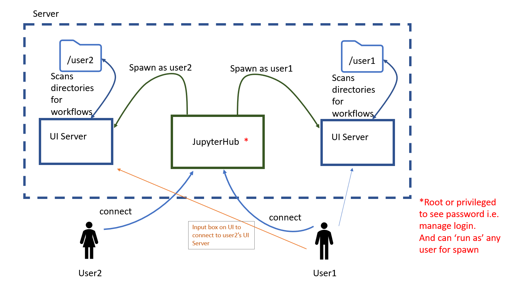

# Multi-User Functionality & Cylc Flow Proposal

## Background

Pre Cylc8 there was some level of multi-user functionality offered by Cylc.

We had the "anonymous" user, the ability to scan other users suites and HTTP(s)
endpoints had authorisation levels.

With the movement to the Cylc8 architecture we are planning to control suites
via a UI Server running as the suite owner for UI purposes meaning that, from
the Cylc Flow perspective we only need to authenticate the suite owner. All
multi-user capability and authorisation happen at the UI Server.

## Introduction

Cylc Flow should be a single-user application with no ability to see or
interact with other users' workflows at all.

All multi-user functionality should be provided by the UI Server and, where
applicable, made accessible to the ``cylc`` CLI tools via the GraphQL
interface.

Work discussed here will be implementing accessing of other users' UI Servers, the orange arrow in the diagram below.



## Security Considerations

In line with the guidance provided by [section 4.1 of the OWASP ASVS](https://github.com/OWASP/ASVS/blob/master/4.0/en/0x12-V4-Access-Control.md#v41-general-access-control-design) (Application Security Verification Standard):

* Authorisation will be *fail secure* and *deny by default*. That is, unless explicit authorisation has been granted to the user to perform a given action, UI Servers will be locked down.
* The *principle of least privilege* should be adhered to, whereby users are only granted those privileges that are essential to the work they are doing. To achieve this, UI Server owners will need a sufficient level of granularity for configuring access.

UI Server back-end code should prevent users manipulating client-side code to bypass authorisation. For example, sending a GraphQL query for a different operation to that stated in the operation name parameter.

## Configuration

Two configuration files will be needed, one for site and one for users, which could take the form as discussed in CylcCon2020. This authorisation configuration can be added to the existing UI Server config files.

### Example UI Server User Configuration

```python
c.UIServer.authorisation = {
    "<user1>": {
        "read": True,                     # View only with no interaction allowed
        "write": ["mut1", "mut2", ...],   # Interactions allowed with tasks
        "execute": True                   # Play and Stop at workflow level
    },
    "group:<group1>": {                   # Read is implied by Write
        "write": True                     # All mutations except Play and Stop
    }
    "<user2>": {
        "execute": True                   # Read and Write implied by Execute
    },    
}
```

### Example Site Configuration

```python
c.UIServer.authorisation = {
    { 
        "<server_user1>": {         # User who owns a given UI Server
            "<user1>": {
                "execute": True                   
            },
            "group:<group1>": {              
                "write": True                  
            }
            "*": {                  # Glob for all authenticated users
                "read": True                  
            }
        },
         "group:<group_of_server_users1>": {  # Group of users who own UI Servers  
             ...
         }
    }    
}
```

With mutation-level granularity `play` and `stop` could be added under the `write` mutations list instead of having an execute role.

We should set a recommended permissions level for the user config file. It will be created with the default umask, which could pose a security risk. Perhaps we could have a warning in the log if the file permissions are not strict enough.  

### Site vs. User Config Precedence

At CylcCon2020 is was agreed that a:

> user can ramp up authorization levels as far as the site allows

Currently this will be taken to mean that the site config takes precedence - users cannot raise access levels in their UI Server config for a given user or group, higher than those set in site config.

If the site config does not set access for a given user or group then a UI Server will **not** be limited by site config.

The development team should discuss this to refine it further.

### Access Group Inheritance

A user/group with `execute: True` should be assumed to have `read: True` and `write: True`, similarly, a `write: True` user/group should have `read:True` access.
This would need to be documented for sites and users.

## Ongoing Investigation: Fetching User Groups

I've tried a number of methods for fetching group membership for the authenticated browser users i.e. return the same groups as I see using `groups` on the Linux command line, which should be both local groups and remote via SSSD/LDAP.

One method reliably returns the expected under PAM:

```python
group_ids = os.getgrouplist(username, 0)
group_ids.remove(0)
users_groups = list(map(lambda x: grp.getgrgid(x).gr_name, group_ids))
```

The outstanding issues with this, that I'd like to resolve is the required second `gid` parameter:

> An integer value representing a group id.
> If gid does not belong to the specified user, it will also be included in the return list

I've used 0 for `root` in the proof of concept work but ideally we would use something like `sys.maxint`.

Testing this works on users' systems might present some challenges - this would preferably be heavily beta tested. If we have concerns, a cruder alternative might be to `Popen` out to the command line `groups`.

If an organisation has a level of nesting in their groups, investigation is still needed - does the command pull the nested groups too? If not, we need to document this limitation for users.

## Ongoing Investigation: Reading Config Behaviour

If a user changes their config, for example, to reduce permissions, we would expect them to restart their UI Server for those changes to take effect. Restarts are currently required for UI updates.

Having a regular interval reload of the config may be an option, depending on other/future configuration requirements. However this interval time could pose a security risk and effects on performance would need to be considered.

## Work Breakdown

The beginnings of the authorisation work have been started [Proof of Concept PR](https://github.com/cylc/cylc-uiserver/pull/204), this is not production ready but a fair chunk of the work has been completed.
This uses hard coded config, the basic functionality of read/write/execute permissions is in place.
Also included in that PR is the beginnings of the user config work.

Still to be completed, once authorisation fine detail has been agreed upon...

* Clear logging of user interaction.
* Config fine tuning.
* Auth group inheritance.
* UI error handling for 403 - e.g. handle read only users getting 403 on write attempt.
* Ramp up / ramp down logic for site vs. user config.
* UI to display greyed out buttons for mutations without authorisation.
* UI to display currently authenticated user and editable buttons for navigation to another UI Server.
* Documentation for Authorisation
* Set up GH Actions to incorporate multi-user access testing using docker (still at the investigation stage).

## Enhancements

* Other possible configured attributes such as time-based authorisation. e.g. limit access to UI Server to User_A for 30 minutes.

Whilst this would be useful to help users debug their workflows, screen sharing through Teams, for example, can currently provide access to a users UI Server and workflows. The control can be handed over to another user but the owner/user can remove access control at any time.

* Workflow level granularity

Initially this authorisation work will be implemented on an all workflow basis, i.e. grant User_A access to all my workflows.
Future work could implement authorisation configuration on a per-workflow basis.

* Access on the command line

e.g.

```console
$ # stop myflow locally
$ cylc stop myflow
$ # stop alice's flow via the UIS
$ cylc stop ~alice/theirflow
$ # stop all flows via the UIS
$ cylc stop '*'
```

* Access level change requiring re-authentication

A change in access level interactions with a workflow could require the user to have to re-authenticate. For example, User A accessing User B's workflows, on an attempted execute operation for a workflow would require User A to login again to re-authenticate themselves.
