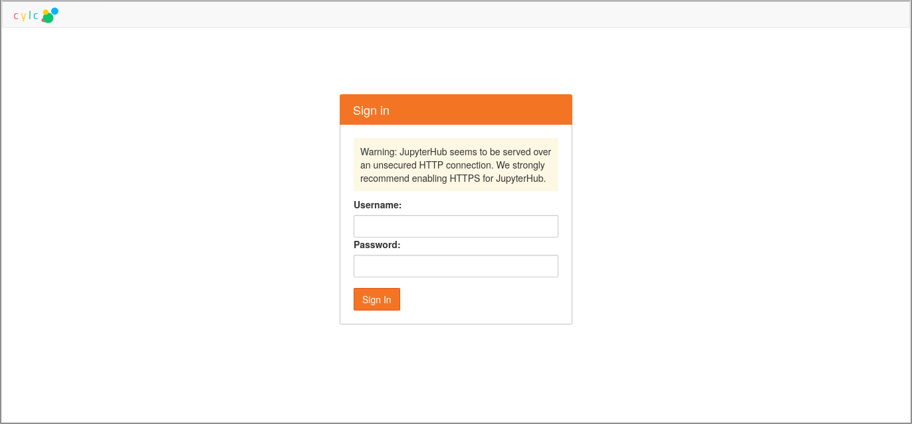
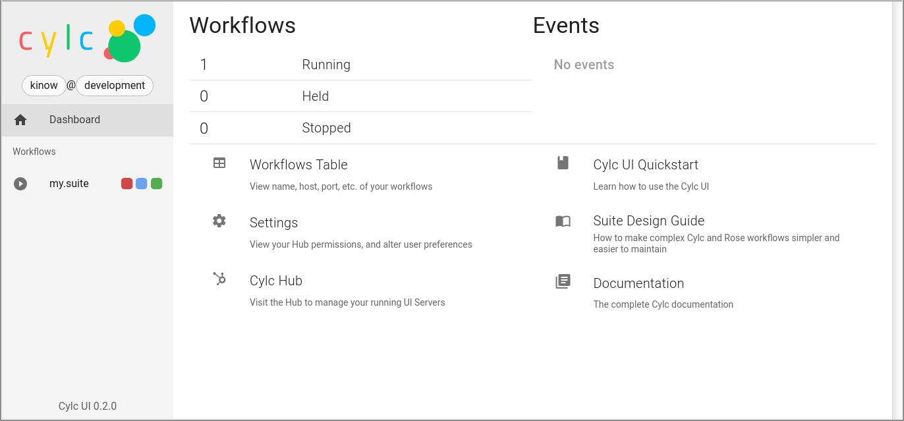
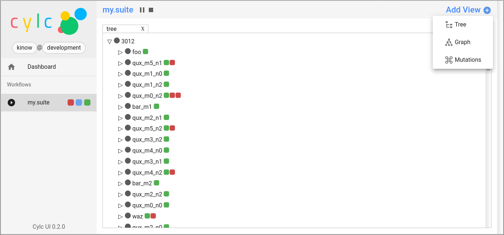
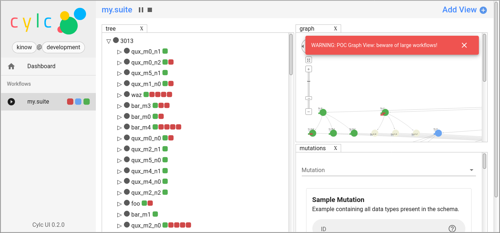
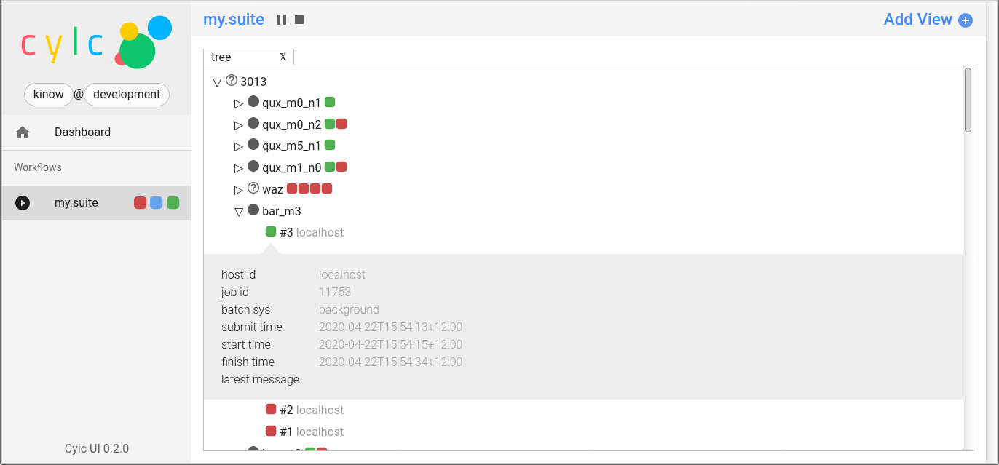
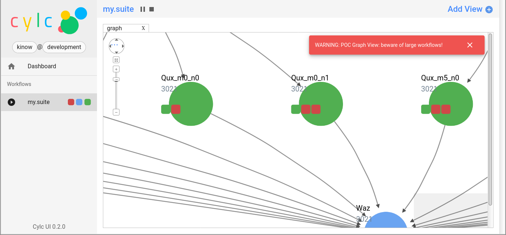
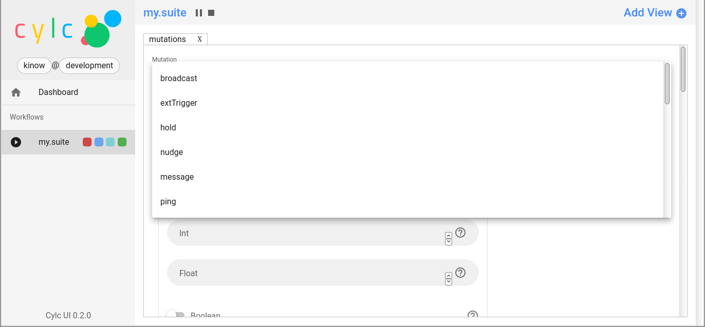
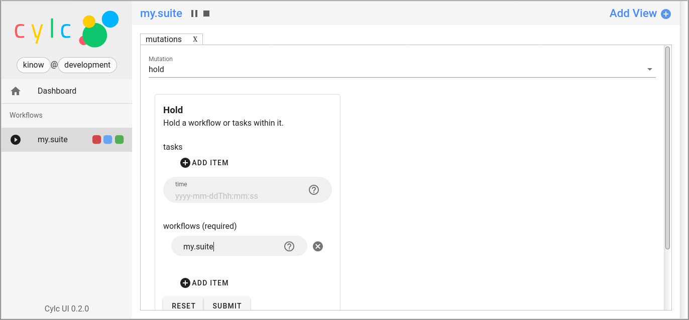
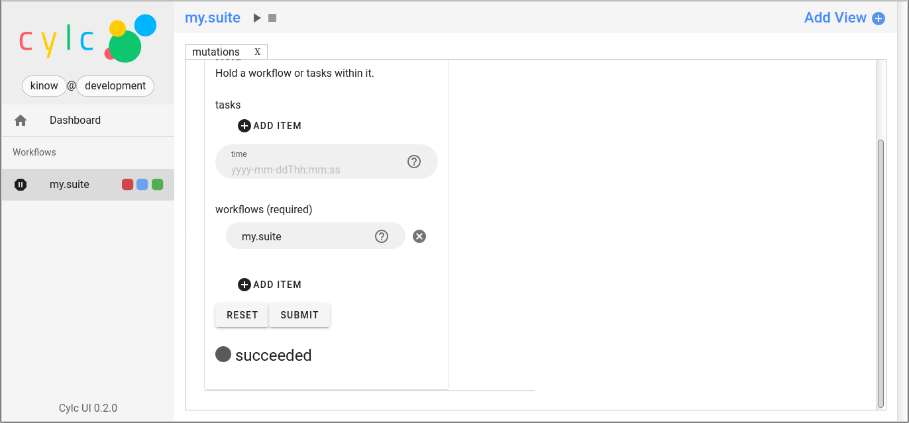

# Cylc 8 alpha2

Date: Q2/2020.

The second “alpha” preview release of Cylc 8 is available for viewing and
testing by interested users.

**NB: This is not a production-ready release.**

Feel free to reach us at [Discourse](https://cylc.discourse.group/) if you have
questions, or create issues or pull requests via [GitHub](https://github.com/cylc/),
should you find any bugs or would like to suggest new features for Cylc 8.

We encourage users who have successfully tested this release to send a
short message on Discourse to let us know how was the installation process,
any issues found with this release, or anything that we could use to
improve future releases.

<!-- https://ecotrust-canada.github.io/markdown-toc/ -->
* [Installation instruction](#installation-instruction)
  + [Conda](#conda)
  + [pip](#pip)
  + [Testing the installation](#testing-the-installation)
  + [Usage](#usage)
* [Current Limitations](#current-limitations)
* [What's new](#whats-new)

## Installation instruction

The minimum requirements for Cylc 8 are:

- Python 3.7 (not tested on Python 3.8)
- Linux (some developers experimented with MacOS and FreeBSD,
but there is no support for those environments yet)
- A modern web browser if using the Cylc web UI

The Cylc 8 complete system includes:

- cylc-flow-8.0a2 - Python 3 Workflow Service and CLI
- cylc-uiserver-0.2 - Python 3 UI Server component of the Cylc 8 architecture
- cylc-ui-0.2 - Vue.js web UI
- JupyterHub 1.+ - authenticates users and launches their Cylc UI Servers
- configurable-http-proxy - node.js proxy
- *(and all software dependencies of the above)*

### Conda

```bash
# optional conda environment
conda create -n cylc1
conda activate cylc1

# then install Cylc metapackage
conda install cylc
```

You can review the Conda [cylc metapackage here](https://github.com/conda-forge/cylc-feedstock).
It will install the required Conda dependencies for Cylc 8, such as Cylc Flow,
Cylc UI Server, and Cylc UI. Taking care to pick the correct versions.

### pip

- `pip install cylc-flow==8.0a2`
- `pip install cylc-uiserver=0.2`
- Download the 0.2 release of Cylc UI ad unzip in a directory accessible to
Python (watch out for SELinux)
- Configure your `jupyterhub_config.py` using this
[Cylc UI example file](https://github.com/cylc/cylc-uiserver/blob/master/jupyterhub_config.py)
(make sure to set the right location of Cylc UI)

### Testing the installation

Once you have installed Cylc 8, you should be able to run Cylc commands, e.g.:

- `cylc --version`
- `cylc run --no-detach my.suite`
- `cylc-uiserver --help`

### Usage

Start the Hub (JupyterHub gets installed with the Conda "cylc" package):

```bash
mkdir -p "${HOME}/srv/cylc/"  # the hub will store session information here
cd "${HOME}/srv/cylc/"
jupyterhub \
    --JupyterHub.spawner_class="jupyterhub.spawner.LocalProcessSpawner" \
    --JupyterHub.logo_file="${CONDA_PREFIX}/work/cylc-ui/img/logo.svg" \
    --Spawner.args="['-s', '${CONDA_PREFIX}/work/cylc-ui']" \
    --Spawner.cmd="cylc-uiserver"
```

Voilà 🎉. Go to http://localhost:8000, log in to the Hub with your
local user credentials, and enjoy Cylc 8 alpha2!

- Start a workflow with the CLI ((\*)a
good example is shown at the end of this section)
- Log in at the Hub to authenticate and launch your UI Server



- Note that much of the UI Dashboard is not functional yet. The
functional links are:
  * Cylc Hub
  * Workflows Table (shows the alpha 1 listing of workflows)
  * Suite Design Guide (web link)
  * Documentation (web link)
- In the left side-bar, you will find the port of Cylc 7's GScan view,
showing your active workflows. Click on the workflow name to view your
running workflows.



- In the new workflow view:
  - add more views to the current UI using the “Add View” button (top right corner)





- In the tree view:
  - click on family names to see the list of task names
  - click on task names to see the list of task jobs
  - click on job icons to see the detail of a specific job



- in the graph view
  - **the graph view is experimental, and may show performance degradation for large workflows**
  - use the bottom left "panzoom" control to change the graph view
  - click on the graph to move around



- in the mutations view
  - **this is a proof-of-concept, intended to allow users to control
  workflows from the Web UI, and will change in future releases**
  - choose a mutation using the first combo box item
  - fill the required fields (e.g. workflow name)
  - press submit and wait for the confirmation message (e.g. "succeeded", and if you
  held the workflow, for instance, on the GScan left-side component the workflow icon
  should now have a different icon)







To deactivate and/or remove the conda environment:

- `conda deactivate`
- `conda env remove -n cylc1`

*(\*) The following workflow generates a series of tasks
that initially fail before succeeding after a random
number of retries (this shows the new "Cylc 8 task/job
separation" nicely)*:

```
[cylc]
   cycle point format = %Y
   [[parameters]]
      m = 0..5
      n = 0..2
[scheduling]
   initial cycle point = 3000
   [[graph]]
      P1Y = "foo[-P1Y] => foo => bar<m> => qux<m,n> => waz"
[runtime]
   [[root]]
      script = """
         sleep 20
         # fail 50% of the time if try number is less than 5
         if (( CYLC_TASK_TRY_NUMBER < 5 )); then
           if (( RANDOM % 2 < 1 )); then
              exit 1
           fi
         fi"""
      [[[job]]]
         execution retry delays = 6*PT2S
```

## Current Limitations

**Cylc-8.0a1 is an early full-system Cylc 8 preview release**

- It has a fully functional Python 3 workflow service and CLI that can run existing Cylc workflows

**BUT:**

- It is not production-ready yet
  * Use the latest cylc-7.8 release in production
- Do not use it where security is a concern
- The UI includes a prototype "tree view" with no control capability
  * we are working on other views, and controls
- Data update in the UI is via WebSockets now, but there is still
a delay of 5 seconds (now server-side instead of client-side polling),
and monolithic
  * future releases will use incremental update (deltas) and remove
  the polling by an event-based approach
- In Cylc 8 users may see more than what is in the task pool
  * Users familiar with Cylc 7 may see tasks that have finished still
  being displayed in the Cylc UI (web or terminal). This might
  change in future releases
- Remote tasks/jobs is still work-in-progress due to architecture
and code changes
- We are still working on the documentation for Cylc 8, stay tuned

## What's new

It has been seven months since the
[previous Cylc 8 alpha release](https://cylc.discourse.group/t/cylc-8-0a1-preview-release-via-conda/149).
And a lot of work has been done so far. Our changelog contains the most significant
improvements and bug fixes.

- [https://github.com/cylc/cylc-flow/blob/master/CHANGES.md](https://github.com/cylc/cylc-flow/blob/master/CHANGES.md)
- [https://github.com/cylc/cylc-uiserver/blob/master/CHANGES.md](https://github.com/cylc/cylc-uiserver/blob/master/CHANGES.md)
- [https://github.com/cylc/cylc-ui/blob/master/CHANGES.md](https://github.com/cylc/cylc-ui/blob/master/CHANGES.md)

The following list highlights some new features since the previous
alpha 1 release.

- Cylc Flow
  * new terminal UI, `cylc tui my.suite`, a modern and improved version of
   `cylc monitor` (now decommissioned) [cylc-flow #3463](https://github.com/cylc/cylc-flow/pull/3463)
  * Cylc Flow now supports plug-ins, allowing parts of the Cylc core
  to be extended by users [cylc-flow #3485](https://github.com/cylc/cylc-flow/issues/3485)
- Cylc UI Server
  * we have added GraphQL subscriptions to Cylc UI Server adding the server-side WebSocket support [cylc-uiserver #82](https://github.com/cylc/cylc-uiserver/pull/82)
- Cylc UI
  * the tree view now displays families [cylc-ui #291](https://github.com/cylc/cylc-ui/pull/291)
  * new GScan component showing the running workflows [cylc-ui #301](https://github.com/cylc/cylc-ui/pull/301)
  * WebSockets added to the client side, requesting GraphQL subscriptions [cylc-ui #280](https://github.com/cylc/cylc-ui/pull/280)
  * workflow view built with Lumino (same library as JupyterLab) allowing tabbed views
  (tree and graph at the moment) [cylc-ui #325](https://github.com/cylc/cylc-ui/pull/325)
  * a new component showing when the Cylc UI server is offline [cylc-ui #379](https://github.com/cylc/cylc-ui/pull/379)
- Conda installation
  * a new component for users to experiment with mutations [cylc-ui #339](https://github.com/cylc/cylc-ui/issues/339)
  (see linked issues)
  * We finished creating conda forge repositories for all our Python
  and JavaScript projects, as well as for a couple of dependencies of
  Cylc Flow. That means users can install Cylc 8 directly from Conda
  Forge with no extra steps required.

We also had several issues fixed related to the [new architecture](https://cylc.github.io/cylc-admin/cylc-8-architecture)
of Cylc 8, as well as other changes related to the port of the old GUI
to the new Web UI, and dependency updates (for latest features but also security).
