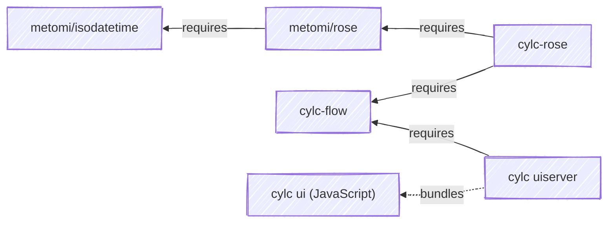

### Cylc Repository Dependency Graph

Current meta-release versions for this dependency tree can be viewed at the [project status page](https://github.com/cylc/cylc-admin/blob/master/docs/status/status.md).
